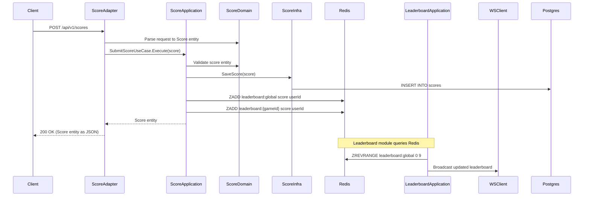

# Real-Time Leaderboard System

A high-performance, modular real-time leaderboard system built with Go, following Clean Architecture principles. The system ranks users based on their scores across various games and provides real-time updates via WebSocket.

## Table of Contents

- [Architecture](#architecture)
- [Features](#features)
- [Project Structure](#project-structure)
- [Modules](#modules)
- [Technology Stack](#technology-stack)
- [Getting Started](#getting-started)
- [API Documentation](#api-documentation)
- [Development](#development)
- [Microservice Migration](#microservice-migration)

## Architecture

The system follows **Clean Architecture** principles with clear layer separation:

- **Domain Layer**: Core entities and repository interfaces (no dependencies)
- **Application Layer**: Use cases and business logic orchestration
- **Adapters Layer**: HTTP/WebSocket handlers (input adapters)
- **Infrastructure Layer**: Repository implementations, external services (output adapters)

### System Architecture Diagram

```mermaid
graph TB
    subgraph client[Client Applications]
        WebClient[Web Client]
        MobileClient[Mobile Client]
    end
    
    subgraph api[API Gateway Layer]
        Router[HTTP Router]
        WSRouter[WebSocket Router]
    end
    
    subgraph authModule[Auth Module - Self Contained]
        AuthAdapter[Auth Adapters HTTP]
        AuthApplication[Auth Application Use Cases]
        AuthDomain[Auth Domain Entities]
        AuthDomainRepo[Auth Repository Interface]
        AuthInfra[Auth Infrastructure]
    end
    
    subgraph scoreModule[Score Module - Self Contained]
        ScoreAdapter[Score Adapters HTTP]
        ScoreApplication[Score Application Use Cases]
        ScoreDomain[Score Domain Entities]
        ScoreDomainRepo[Score Repository Interface]
        ScoreInfra[Score Infrastructure]
    end
    
    subgraph leaderboardModule[Leaderboard Module - Self Contained]
        LeaderboardAdapter[Leaderboard Adapters HTTP/WS]
        LeaderboardApplication[Leaderboard Application Use Cases]
        LeaderboardDomain[Leaderboard Domain Entities]
        LeaderboardDomainRepo[Leaderboard Repository Interface]
        LeaderboardInfra[Leaderboard Infrastructure]
    end
    
    subgraph reportModule[Report Module - Self Contained]
        ReportAdapter[Report Adapters HTTP]
        ReportApplication[Report Application Use Cases]
        ReportDomain[Report Domain Entities]
        ReportDomainRepo[Report Repository Interface]
        ReportInfra[Report Infrastructure]
    end
    
    subgraph shared[Shared Components]
        Errors[Error Definitions]
        Response[Response Helpers]
        Middleware[Middleware]
        Logger[Logger]
        Validator[Validator]
        Database[Database Connection]
        Redis[Redis Connection]
    end
    
    subgraph infra[External Services]
        Postgres[(PostgreSQL)]
        Redis[(Redis)]
    end
    
    WebClient --> Router
    MobileClient --> Router
    WebClient --> WSRouter
    
    Router --> AuthAdapter
    Router --> ScoreAdapter
    Router --> LeaderboardAdapter
    Router --> ReportAdapter
    WSRouter --> LeaderboardAdapter
    
    AuthAdapter --> AuthApplication
    AuthApplication --> AuthDomain
    AuthApplication --> AuthDomainRepo
    AuthDomainRepo --> AuthInfra
    AuthInfra --> Database
    Database --> Postgres
    
    ScoreAdapter --> ScoreApplication
    ScoreApplication --> ScoreDomain
    ScoreApplication --> ScoreDomainRepo
    ScoreDomainRepo --> ScoreInfra
    ScoreInfra --> Database
    ScoreInfra --> RedisClient
    Database --> Postgres
    RedisClient --> Redis
    
    LeaderboardAdapter --> LeaderboardApplication
    LeaderboardApplication --> LeaderboardDomain
    LeaderboardApplication --> LeaderboardDomainRepo
    LeaderboardDomainRepo --> LeaderboardInfra
    LeaderboardInfra --> RedisClient
    RedisClient --> Redis
    
    ReportAdapter --> ReportApplication
    ReportApplication --> ReportDomain
    ReportApplication --> ReportDomainRepo
    ReportDomainRepo --> ReportInfra
    ReportInfra --> RedisClient
    ReportInfra --> Database
    RedisClient --> Redis
    Database --> Postgres
    
    AuthAdapter --> Middleware
    ScoreAdapter --> Middleware
    LeaderboardAdapter --> Middleware
    ReportAdapter --> Middleware
    
    AuthApplication --> Errors
    ScoreApplication --> Errors
    LeaderboardApplication --> Errors
    ReportApplication --> Errors
    
    AuthAdapter --> Response
    ScoreAdapter --> Response
    LeaderboardAdapter --> Response
    ReportAdapter --> Response
    
    AuthApplication --> Logger
    ScoreApplication --> Logger
    LeaderboardApplication --> Logger
    ReportApplication --> Logger
```



### Data Flow Example



## Features

- **User Authentication**: JWT-based authentication with access and refresh tokens
- **Score Submission**: Submit scores for different games with metadata support
- **Real-Time Leaderboards**: Global and game-specific leaderboards with WebSocket updates
- **User Rankings**: Query user rankings in any leaderboard
- **Top Players Reports**: Generate reports with optional date range filtering
- **Redis Sorted Sets**: Efficient leaderboard storage and queries using Redis sorted sets
- **Clean Architecture**: Modular, testable, and maintainable code structure
- **Microservice Ready**: Each module is self-contained and can be extracted to a microservice

## Project Structure

```
real-time-leaderboard/
├── cmd/
│   └── server/
│       └── main.go                 # Application entry point
├── internal/
│   ├── config/                     # Configuration management
│   │   └── config.go
│   ├── shared/                     # Shared utilities and infrastructure
│   │   ├── errors/                # Error definitions
│   │   ├── response/               # API response helpers
│   │   ├── middleware/             # HTTP middleware
│   │   ├── logger/                 # Logger implementation
│   │   ├── validator/              # Request validation
│   │   ├── database/               # Database connections
│   │   │   └── migrations/        # Database migrations
│   │   └── redis/                  # Redis connections
│   └── module/                     # Self-contained modules
│       ├── auth/                   # Auth Module
│       │   ├── domain/            # Domain layer
│       │   ├── application/       # Application layer
│       │   ├── adapters/          # Adapters layer
│       │   └── infrastructure/    # Infrastructure layer
│       ├── score/                  # Score Module
│       ├── leaderboard/            # Leaderboard Module
│       └── report/                 # Report Module
├── scripts/                        # Utility scripts
│   └── migrate.sh
├── docker/
│   └── Dockerfile
├── docker-compose.yml
├── .env.example
├── go.mod
└── README.md
```

## Modules

### Auth Module

**Purpose**: User authentication and authorization

**Components**:
- **Domain**: User entity, UserRepository interface
- **Application**: RegisterUseCase, LoginUseCase, ValidateTokenUseCase, RefreshTokenUseCase
- **Adapters**: HTTP handlers for registration, login, token refresh
- **Infrastructure**: PostgreSQL UserRepository, JWT token manager

**Endpoints**:
- `POST /api/v1/auth/register` - User registration
- `POST /api/v1/auth/login` - User login
- `POST /api/v1/auth/refresh` - Refresh access token

### Score Module

**Purpose**: Score submission and management

**Components**:
- **Domain**: Score entity, ScoreRepository interface, LeaderboardRepository interface
- **Application**: SubmitScoreUseCase, GetUserScoresUseCase
- **Adapters**: HTTP handlers for score submission and retrieval
- **Infrastructure**: PostgreSQL ScoreRepository, Redis LeaderboardRepository

**Endpoints**:
- `POST /api/v1/scores` - Submit score (authenticated)
- `GET /api/v1/scores/me` - Get user's score history (authenticated)

### Leaderboard Module

**Purpose**: Leaderboard queries and real-time updates

**Components**:
- **Domain**: LeaderboardEntry entity, LeaderboardRepository interface
- **Application**: GetGlobalLeaderboardUseCase, GetGameLeaderboardUseCase, GetUserRankUseCase
- **Adapters**: HTTP handlers + WebSocket handler
- **Infrastructure**: Redis LeaderboardRepository (sorted sets)

**Endpoints**:
- `GET /api/v1/leaderboard/global` - Get global leaderboard
- `GET /api/v1/leaderboard/game/:game_id` - Get game-specific leaderboard
- `GET /api/v1/leaderboard/rank/:user_id` - Get user's rank
- `WS /ws/leaderboard` - WebSocket for real-time updates

### Report Module

**Purpose**: Top players reports and analytics

**Components**:
- **Domain**: TopPlayer entity, ReportRepository interface
- **Application**: GetTopPlayersReportUseCase
- **Adapters**: HTTP handler for report generation
- **Infrastructure**: Composite repository (Redis + PostgreSQL)

**Endpoints**:
- `GET /api/v1/reports/top-players` - Top players report (with optional date range)

## Technology Stack

- **Language**: Go 1.21+
- **Web Framework**: Gin
- **Database**: PostgreSQL 15+
- **Cache/Ranking**: Redis 7+ (sorted sets)
- **Authentication**: JWT (github.com/golang-jwt/jwt/v5)
- **Database Driver**: pgx/v5
- **Redis Client**: go-redis/v9
- **WebSocket**: Gorilla WebSocket
- **Validation**: go-playground/validator/v10
- **Logging**: zerolog

## Getting Started

### Prerequisites

- Go 1.21 or higher
- Docker and Docker Compose
- PostgreSQL 15+ (if running locally)
- Redis 7+ (if running locally)

### Installation

1. **Clone the repository**:
```bash
git clone <repository-url>
cd real-time-leaderboard
```

2. **Copy environment variables**:
```bash
cp .env.example .env
```

3. **Start services with Docker Compose**:
```bash
docker-compose up -d
```

This will start:
- PostgreSQL on port 5432
- Redis on port 6379
- Application on port 8080

4. **Run database migrations**:
```bash
# Install migrate tool if not already installed
go install -tags 'postgres' github.com/golang-migrate/migrate/v4/cmd/migrate@latest

# Run migrations
./scripts/migrate.sh up
```

5. **Run the application**:
```bash
go run cmd/server/main.go
```

The server will start on `http://localhost:8080`

## API Documentation

### Authentication

#### Register User
```http
POST /api/v1/auth/register
Content-Type: application/json

{
  "username": "john_doe",
  "email": "john@example.com",
  "password": "password123"
}
```

#### Login
```http
POST /api/v1/auth/login
Content-Type: application/json

{
  "username": "john_doe",
  "password": "password123"
}
```

Response:
```json
{
  "success": true,
  "data": {
    "user": {
      "id": "uuid",
      "username": "john_doe",
      "email": "john@example.com"
    },
    "token": {
      "access_token": "jwt_token",
      "refresh_token": "jwt_token",
      "expires_in": 900
    }
  }
}
```

### Scores

#### Submit Score
```http
POST /api/v1/scores
Authorization: Bearer <access_token>
Content-Type: application/json

{
  "game_id": "game1",
  "score": 1000,
  "metadata": {
    "level": 5,
    "time": 120
  }
}
```

#### Get User Scores
```http
GET /api/v1/scores/me?game_id=game1&limit=10&offset=0
Authorization: Bearer <access_token>
```

### Leaderboard

#### Get Global Leaderboard
```http
GET /api/v1/leaderboard/global?limit=10
```

#### Get Game Leaderboard
```http
GET /api/v1/leaderboard/game/game1?limit=10
```

#### Get User Rank
```http
GET /api/v1/leaderboard/rank/{user_id}?game_id=game1
```

### Reports

#### Get Top Players Report
```http
GET /api/v1/reports/top-players?game_id=game1&start_date=2024-01-01T00:00:00Z&end_date=2024-01-31T23:59:59Z&limit=10
```

### WebSocket

Connect to `ws://localhost:8080/ws/leaderboard?game_id=game1` for real-time leaderboard updates.

## Development

### Project Structure Best Practices

1. **Domain Layer**: Contains pure business logic, no external dependencies
2. **Application Layer**: Orchestrates use cases, depends only on domain interfaces
3. **Adapters Layer**: Handles HTTP/WebSocket, works with domain entities directly
4. **Infrastructure Layer**: Implements repository interfaces, handles external services

### Adding a New Module

1. Create module directory: `internal/module/{module_name}/`
2. Create layers: `domain/`, `application/`, `adapters/`, `infrastructure/`
3. Define domain entities and repository interfaces
4. Implement use cases in application layer
5. Create HTTP handlers in adapters layer
6. Implement repositories in infrastructure layer
7. Wire everything in `cmd/server/main.go`

### Testing

```bash
# Run all tests
go test ./...

# Run tests with coverage
go test -cover ./...

# Run tests for a specific module
go test ./internal/module/auth/...
```

### Database Migrations

```bash
# Create a new migration
migrate create -ext sql -dir internal/shared/database/migrations -seq migration_name

# Run migrations
./scripts/migrate.sh up

# Rollback migrations
./scripts/migrate.sh down
```

## Microservice Migration

Each module is designed to be self-contained and can be easily extracted into a microservice.

### Migration Steps

1. **Copy module directory** to new service repository
2. **Update dependencies**: Replace shared infrastructure with service-specific connections
3. **Add inter-service communication**: Implement gRPC or REST clients for cross-service calls
4. **Update shared components**: Either copy shared components or use a shared library
5. **No refactoring needed**: Module structure remains the same

### Example: Extracting Leaderboard Module

```
leaderboard-service/
├── cmd/
│   └── server/
│       └── main.go
├── internal/
│   ├── config/
│   ├── shared/          # Copy or use shared library
│   │   └── redis/       # Redis connection (shared infrastructure)
│   └── module/
│       └── leaderboard/ # Copy entire module - no changes needed
```

### Benefits

- **Clear Boundaries**: Each module owns its domain, infrastructure, and presentation
- **Easy Testing**: Mock repository interfaces at domain level
- **Independent Deployment**: Modules can be versioned and deployed separately
- **Team Ownership**: Different teams can own different modules
- **Technology Flexibility**: Each module can use different technologies

## Redis Sorted Sets Strategy

The leaderboard uses Redis sorted sets for efficient ranking:

- **Key Pattern**: `leaderboard:{game_id}` for per-game leaderboards
- **Key Pattern**: `leaderboard:global` for global leaderboard
- **Score**: User's total score (as Redis score)
- **Member**: User ID

**Commands Used**:
- `ZADD` - Update/add user score
- `ZREVRANGE` - Get top N players
- `ZREVRANK` - Get user's rank
- `ZSCORE` - Get user's score
- `ZCARD` - Get total players

## License

MIT

## Contributing

Contributions are welcome! Please feel free to submit a Pull Request.
