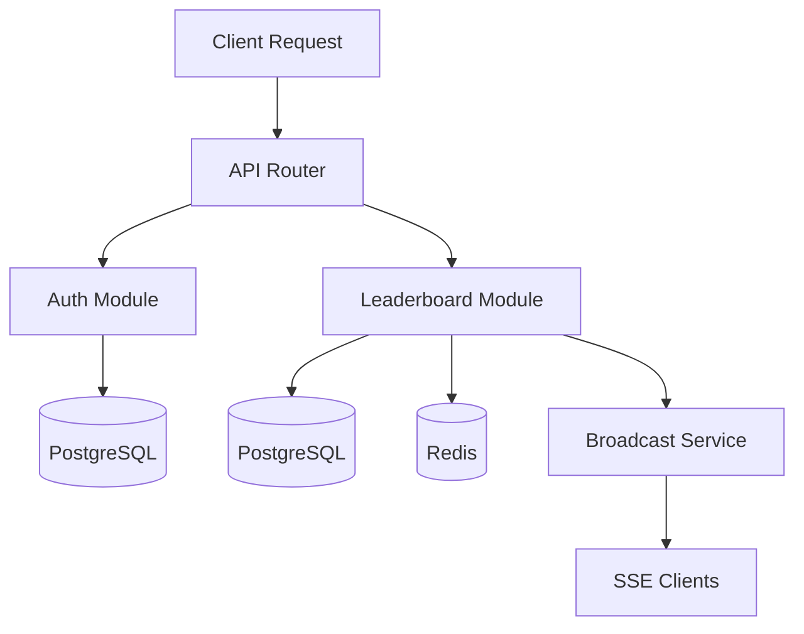

# Application Features & Flows

This document describes the general application features and high-level flows from a system-wide perspective.

## Features Overview

The Real-Time Leaderboard System provides the following general features:

- **Modular Architecture**: Self-contained modules following Clean Architecture principles
- **JWT Authentication**: Token-based authentication with access and refresh tokens
- **Real-Time Updates**: Server-Sent Events (SSE) for live data updates
- **Data Persistence**: PostgreSQL for persistent storage with Redis for caching
- **Scalable Design**: Supports multiple server instances with distributed coordination
- **Microservice Ready**: Each module is self-contained and can be extracted to a microservice

For detailed module-specific features and flows, see [Modules](./modules.md).

## General Application Flow

The application follows a modular architecture where each module operates independently:

**Key Principles**:
- **Module Independence**: Each module is self-contained with its own domain, application logic, and infrastructure
- **Shared Infrastructure**: Common concerns (logging, middleware, database connections) are shared across modules
- **Clean Architecture**: Each module follows Clean Architecture principles with clear layer separation
- **Cross-Module Communication**: Modules communicate through well-defined interfaces, not direct dependencies

For detailed module-specific flows, see [Modules](./modules.md).

## API Documentation

For complete API documentation including endpoints, request/response formats, and authentication details, see:

- **OpenAPI Specification**: `api/v1/openapi.yaml` - The source of truth for API documentation
- **Swagger UI**: http://localhost:8080/docs/index.html - Interactive API documentation
- **Module Endpoints**: See [Modules](./modules.md) for endpoint listings by module

## Related Documentation

- **[Modules](./modules.md)**: Detailed module structure, components, flows, and endpoints
- **[Architecture](./architecture.md)**: Architectural principles, project structure, and coding conventions
- **[Development Guide](./development.md)**: Development workflow, commands, and setup instructions
