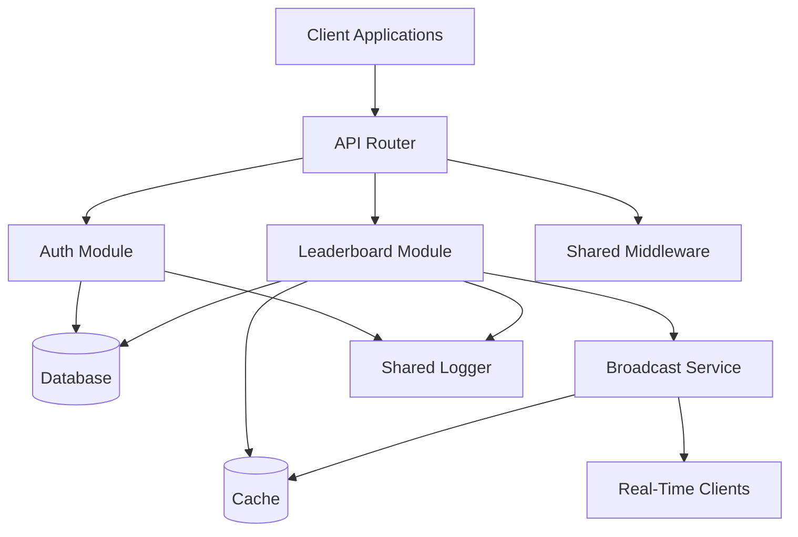

# Application Overview

This document provides a high-level overview of the Real-Time Leaderboard System, its capabilities, and component architecture.

## What It Does

The Real-Time Leaderboard System is a web application that enables:

- **User Authentication**: Users can register, login, and manage their accounts with JWT-based authentication
- **Score Management**: Authenticated users can submit and update their scores
- **Leaderboard Display**: View paginated leaderboards showing top players ranked by score
- **Real-Time Updates**: Live leaderboard updates via Server-Sent Events (SSE) when scores change
- **Scalable Architecture**: Designed to support multiple server instances with distributed coordination

## System Components

The system consists of **2 main modules** and **shared infrastructure**:

### Modules

1. **Auth Module** - Handles user authentication and authorization
2. **Leaderboard Module** - Manages scores, leaderboard queries, and real-time updates

### Shared Infrastructure

- **API Router** - HTTP request routing and middleware
- **Database** - PostgreSQL for persistent data storage
- **Cache** - Redis for high-performance caching and real-time messaging
- **Logger** - Centralized logging system
- **Middleware** - Request processing, authentication, CORS, error handling

## Component Interaction

The following diagram shows how the main components interact:

**Component Relationships**:
- **Client Applications** communicate with the system through the **API Router**
- **API Router** routes requests to appropriate **Modules** based on the endpoint
- **Auth Module** handles authentication and stores user data in the **Database**
- **Leaderboard Module** uses both **Database** (persistence) and **Cache** (performance) for data storage
- **Broadcast Service** uses **Cache** for message distribution and sends updates to **Real-Time Clients**
- All components use **Shared Middleware** and **Shared Logger** for common functionality

For detailed module-specific flows and implementation details, see [Modules](./modules.md).

## API Documentation

For complete API documentation including endpoints, request/response formats, and authentication details, see:

- **OpenAPI Specification**: `api/v1/openapi.yaml` - The source of truth for API documentation
- **Swagger UI**: http://localhost:8080/docs/index.html - Interactive API documentation
- **Module Endpoints**: See [Modules](./modules.md) for endpoint listings by module

## Related Documentation

- **[Modules](./modules.md)**: Detailed module structure, components, flows, and endpoints
- **[Architecture](./architecture.md)**: Architectural principles, project structure, and coding conventions
- **[Development Guide](./development.md)**: Development workflow, commands, and setup instructions
