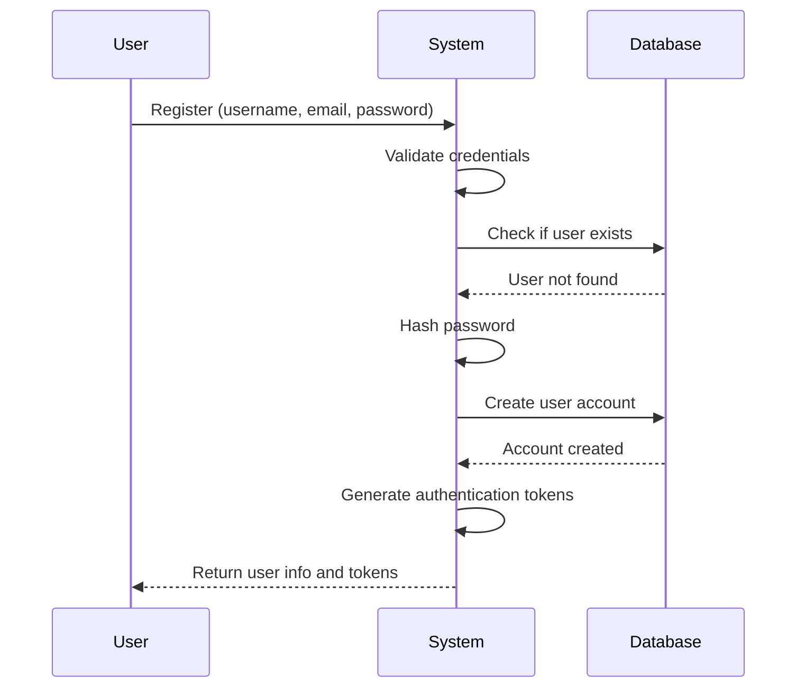
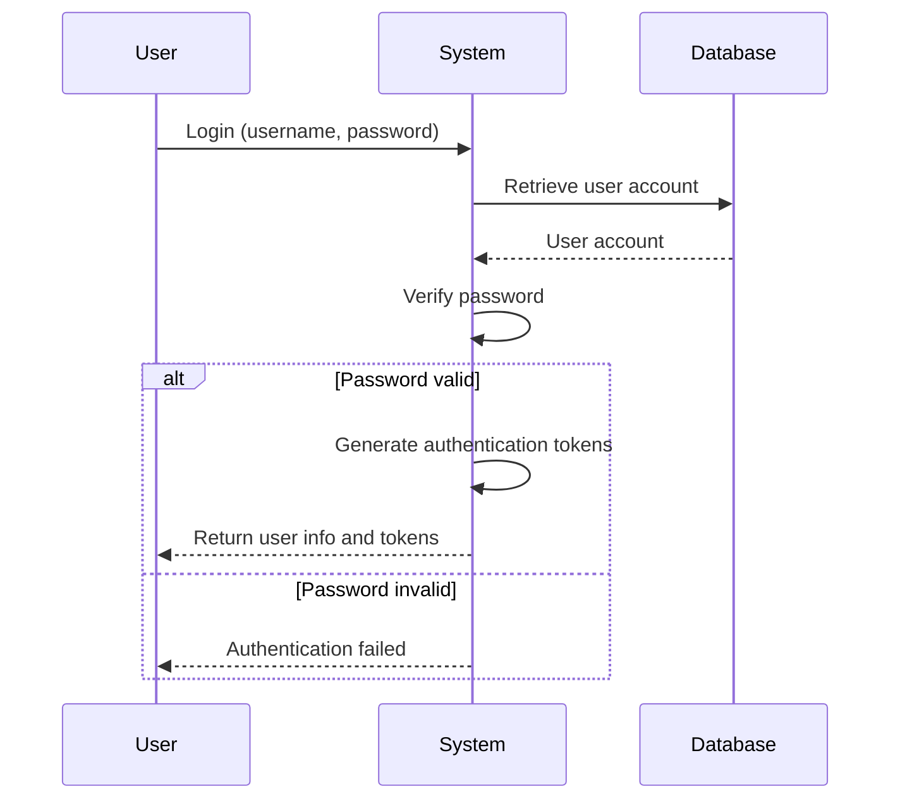
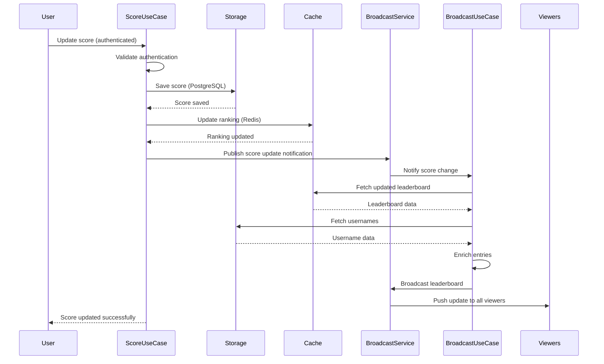
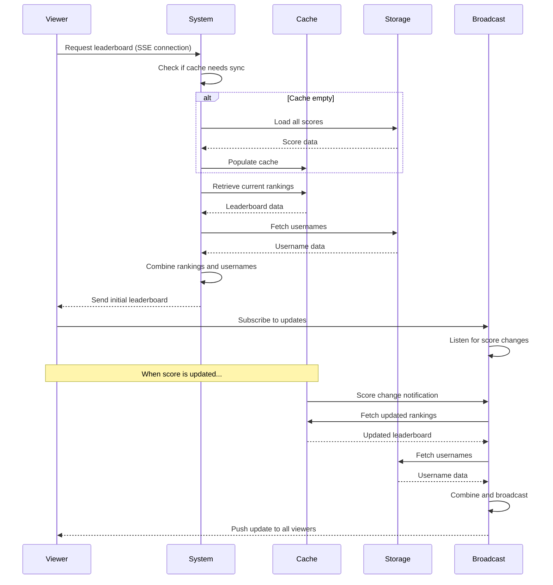
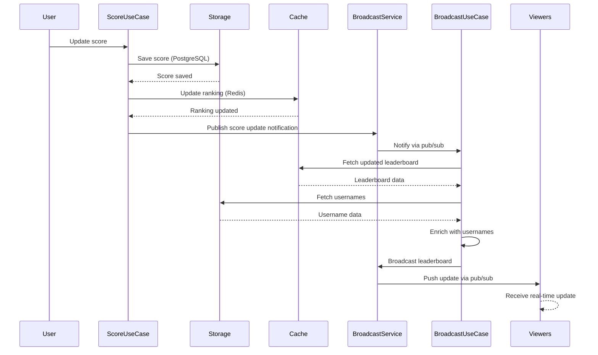
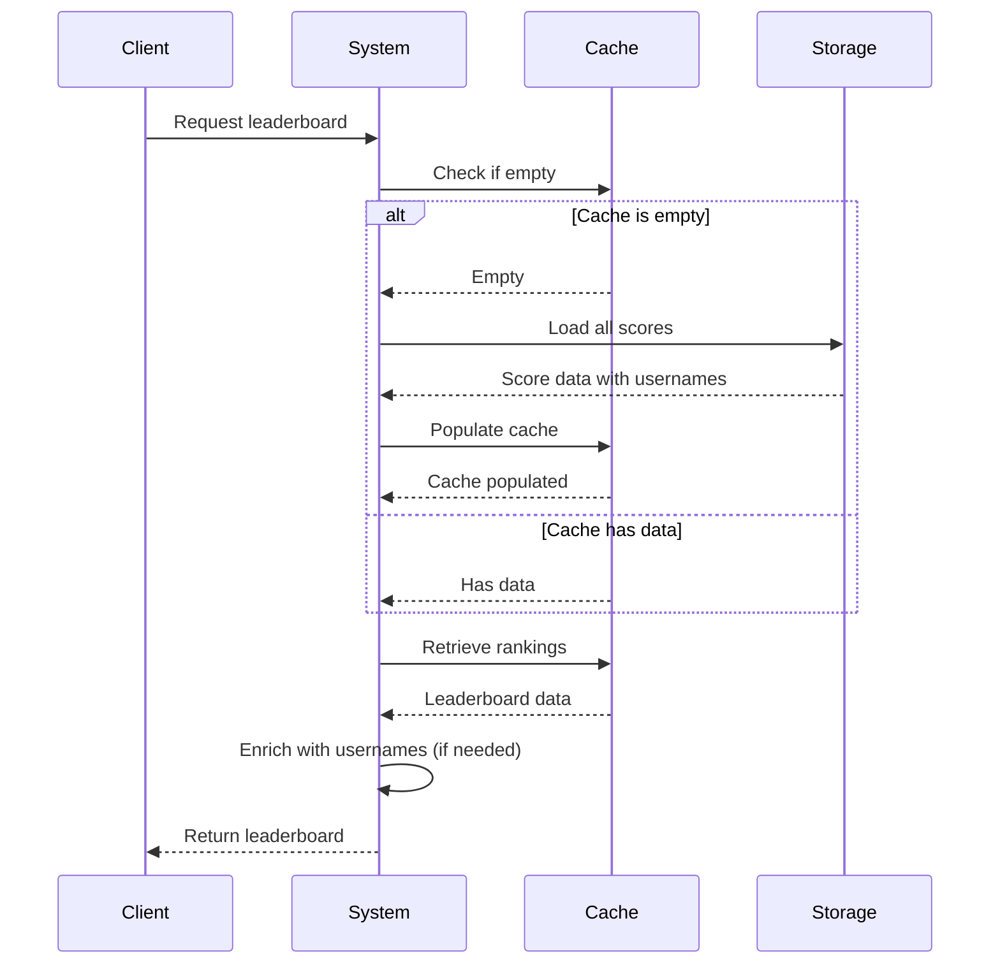
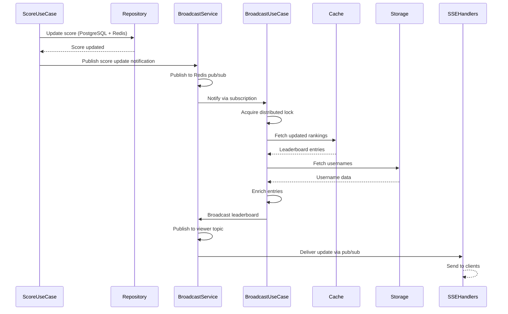
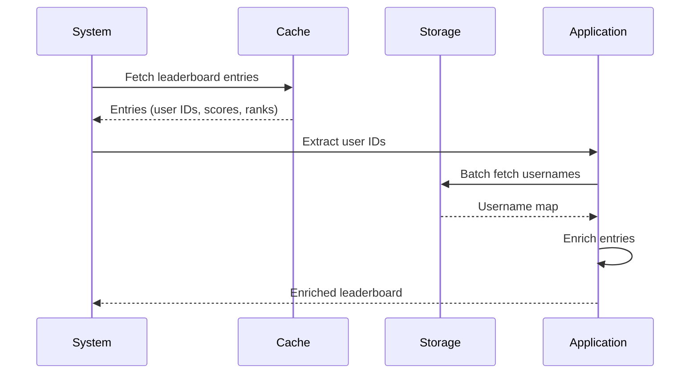

# Application Features & Flows

This document describes the application features and user flows from a high-level perspective.

## Features

The Real-Time Leaderboard System provides the following features:

- **User Authentication**: JWT-based authentication with access and refresh tokens
- **Score Update**: Update scores via PUT endpoint (upserts - creates if not exists, updates if exists)
- **Real-Time Leaderboard**: Single leaderboard with live updates via Server-Sent Events (SSE)
- **Lazy Loading**: Automatic sync from PostgreSQL to Redis when Redis is empty (handles restarts gracefully)
- **PostgreSQL Backup**: Stores score per user as backup/recovery mechanism for Redis
- **Redis Sorted Sets**: Efficient leaderboard storage and queries using Redis sorted sets
- **Redis Pub/Sub**: Real-time notifications for leaderboard updates without polling
- **Pagination Support**: Configurable limit for leaderboard results (default: 100, max: 100)
- **Clean Architecture**: Modular, testable, and maintainable code structure with clear separation of concerns
- **Microservice Ready**: Each module is self-contained and can be extracted to a microservice

### User Authentication

Users can register, login, and manage their authentication sessions using JWT tokens.

**Capabilities**:
- Register new account with username, email, and password
- Login with credentials to receive authentication tokens
- Refresh access tokens to extend sessions
- Get current user information via authenticated endpoint
- Secure password storage with hashing
- Automatic token expiration checking and proactive refresh
- Token validation on all protected endpoints

### Score Management

Users can update their scores, which are automatically ranked in the leaderboard.

**Capabilities**:
- Update score via authenticated endpoint
- Automatic ranking in global leaderboard
- Scores persist across sessions
- Real-time leaderboard updates when scores change

### Real-Time Leaderboard

Users can view the current leaderboard with live updates as scores change.

**Capabilities**:
- View ranked leaderboard with usernames, scores, and ranks
- Real-time updates via Server-Sent Events (no polling)
- Configurable limit for number of entries displayed
- Automatic data recovery if cache is empty

## Application Flows

### User Registration Flow

**What Happens**:
1. User provides registration information
2. System validates and checks for existing accounts
3. Password is securely hashed
4. User account is created
5. Authentication tokens are generated
6. User receives account information and tokens

### User Login Flow

**What Happens**:
1. User provides login credentials
2. System retrieves user account
3. Password is verified
4. If valid, authentication tokens are generated and returned
5. If invalid, authentication error is returned

### Token Management Flow

The system implements JWT-based authentication with automatic token management:

**Token Types**:
- **Access Token**: Short-lived token for API authentication (validated on every request)
- **Refresh Token**: Long-lived token for obtaining new access tokens

**Token Management Features**:
- **Proactive Refresh**: Tokens are automatically refreshed before expiration (configurable buffer time, default: 5 minutes)
- **Expiration Checking**: Token expiration is checked before making API requests
- **Automatic Retry**: Failed requests due to expired tokens are automatically retried after refresh
- **Secure Storage**: Tokens are stored securely in browser localStorage (SPA)
- **User Info Management**: User information is stored separately from tokens (no client-side JWT decoding)

**Current User Endpoint**:
- `GET /api/v1/auth/me` - Returns current authenticated user's information
- Requires valid JWT token in Authorization header
- Provides single source of truth for user information
- Used by SPA to fetch user info without decoding JWT tokens

**SPA Authentication Best Practices**:
- No client-side JWT decoding for user data extraction
- User information retrieved from API endpoints only
- Automatic token refresh prevents failed requests
- Proper error handling for authentication failures
- Token validation on all protected endpoints

### Score Update Flow

**What Happens**:
1. Authenticated user submits new score
2. System validates authentication
3. Score is saved to persistent storage (PostgreSQL)
4. Leaderboard ranking is updated in cache (Redis) - repository only updates data
5. Score use case publishes score update notification via broadcast service
6. Broadcast service notifies the broadcast use case
7. Broadcast use case fetches updated leaderboard and enriches with usernames
8. Broadcast use case broadcasts enriched leaderboard via broadcast service
9. All leaderboard viewers receive update via SSE
10. User receives confirmation

### Real-Time Leaderboard Flow

**What Happens**:

1. **Initial Connection**:
   1. Viewer connects to leaderboard endpoint
   2. System checks if cache needs data from persistent storage
   3. If cache is empty, scores are loaded from storage
   4. Current rankings are retrieved from cache
   5. Usernames are fetched and combined with rankings
   6. Initial leaderboard is sent to viewer

2. **Real-Time Updates**:
   1. Viewer subscribes to live updates
   2. When any score changes:
      - Broadcast service receives notification
      - Updated rankings are fetched
      - Usernames are refreshed
      - Updated leaderboard is pushed to all connected viewers
   3. Viewers receive updates automatically without polling

**Key Characteristics**:
- **Automatic Recovery**: If cache is empty, data is automatically loaded from storage
- **Real-Time**: Updates are pushed immediately when scores change
- **Efficient**: Single broadcast service updates all viewers simultaneously
- **Scalable**: Works across multiple server instances

## Data Flow Overview

### Score Update → Leaderboard Update Flow

**What Happens**:
1. User updates score via authenticated endpoint
2. Score is saved to persistent storage (PostgreSQL)
3. Leaderboard ranking is updated in cache (Redis) - repository only updates data, no publishing
4. Score use case publishes score update notification via broadcast service
5. Broadcast service publishes to Redis pub/sub topic
6. Broadcast use case receives notification and fetches updated leaderboard
7. Leaderboard is enriched with usernames
8. Broadcast use case broadcasts enriched leaderboard via broadcast service
9. Broadcast service publishes to Redis pub/sub viewer topic
10. Viewers receive real-time update via SSE

**Key Characteristics**:
- **Atomic Operations**: Score updates and ranking updates are atomic
- **Real-Time**: Updates are pushed immediately to all viewers
- **Efficient**: Single broadcast service processes update once for all viewers
- **Scalable**: Works across multiple server instances with distributed locking

### Lazy Loading Flow

The system implements **lazy loading** to automatically sync PostgreSQL data to Redis:

**What Happens**:
1. Client requests leaderboard
2. System checks if Redis cache is empty
3. If empty, system loads all scores from PostgreSQL
4. Scores are populated into Redis cache using `UpdateScore` (silent updates, no notifications)
5. Current rankings are retrieved from cache
6. Leaderboard is enriched with usernames (if not already included)
7. Leaderboard is returned to client

**Note**: During lazy loading, `UpdateScore` is called multiple times but does not publish notifications. This ensures no duplicate broadcasts are triggered during sync operations. Only real user score updates (via `ScoreUseCase`) trigger broadcasts.

**Key Features**:
- **Automatic Sync**: On first leaderboard request, if Redis is empty, the system automatically syncs all scores from PostgreSQL to Redis
- **Non-blocking**: Sync happens on-demand, not on startup, ensuring fast application startup
- **Resilient**: Handles Redis restarts gracefully - data is automatically restored on next request
- **Efficient**: Only syncs when needed (Redis is empty), avoiding unnecessary work

**Manual Recovery**:
If Redis data is lost, the system can rebuild the leaderboard from PostgreSQL:
- PostgreSQL stores one record per user with their current score (UPSERT pattern)
- `GetLeaderboard()` retrieves all scores with usernames via JOIN
- All users' scores can be restored to Redis via `ZADD` operations

This ensures the system automatically recovers from cache failures without manual intervention.

## Infrastructure Implementation Details

### Redis Storage Strategy

The leaderboard system uses Redis for real-time queries and notifications:

**Sorted Sets for Leaderboard Storage**:
- Key: `leaderboard:global` (single global leaderboard)
- Score: User's total score (as Redis score)
- Member: User ID
- Commands: `ZADD` (update/add), `ZREVRANGE` (get top N), `ZCARD` (total players)
- Performance: O(log(N)) complexity for insertions, O(log(N)+M) for range queries
- All operations are atomic, no application-level locking needed

**Pub/Sub for Real-Time Notifications**:
- Score Update Topic: `leaderboard:score:updates` - Published when scores are updated
- Viewer Update Topic: `leaderboard:viewer:updates` - Published with full leaderboard JSON
- Distributed Lock: `leaderboard:broadcast:lock` - Prevents duplicate processing in multi-instance deployments
- Infrastructure layer handles all Redis pub/sub connection management

### Broadcast Service Flow

**What Happens**:
1. `ScoreUseCase` updates score in PostgreSQL and Redis (repository only updates data, no publishing)
2. `ScoreUseCase` publishes score update notification via `BroadcastService.PublishScoreUpdate()`
3. Broadcast service publishes to Redis `leaderboard:score:updates` topic
4. `LeaderboardUseCase.StartBroadcasting()` receives notification (via `BroadcastService` interface)
5. Use case acquires distributed lock to prevent duplicate processing
6. Use case fetches full leaderboard from cache
7. Use case fetches usernames from storage
8. Use case enriches leaderboard entries with usernames
9. Use case broadcasts enriched leaderboard via `BroadcastService.BroadcastLeaderboard()`
10. Broadcast service publishes to Redis `leaderboard:viewer:updates` topic
11. SSE handlers subscribe via `LeaderboardUseCase.SubscribeToLeaderboardUpdates()`
12. SSE clients receive updates through handler

**Key Characteristics**:
- **Clean Separation**: Repositories only update data, broadcast service handles all pub/sub
- **Single Processing**: Distributed lock ensures only one instance processes each update
- **Efficient**: Fetches leaderboard once, broadcasts to all clients
- **Scalable**: Works across multiple server instances
- **No Duplicates**: Lazy loading doesn't trigger broadcasts (UpdateScore doesn't publish)

### Username Enrichment Flow

Leaderboard entries include usernames from multiple sources:

**What Happens**:
1. System fetches leaderboard entries from cache (Redis) or storage (PostgreSQL)
2. For PostgreSQL: Usernames are included via JOIN query
3. For Redis: Application layer extracts user IDs from entries
4. Application layer batch fetches usernames using `UserRepository.GetByIDs()`
5. Application layer enriches entries with usernames
6. Enriched leaderboard is returned to clients

**Key Characteristics**:
- **PostgreSQL**: `GetLeaderboard()` joins with `users` table to include usernames directly (single query)
- **Redis**: Entries are enriched via batch fetch in application layer (efficient, no JOIN needed)
- **Clean Separation**: Username enrichment happens in application layer, not infrastructure

This design ensures:
- PostgreSQL queries are efficient (single JOIN query)
- Redis queries remain fast (no JOIN needed)
- Username enrichment happens in application layer (clean separation)

## API Documentation

For complete API documentation including endpoints, request/response formats, and authentication details, see:

- **OpenAPI Specification**: `api/v1/openapi.yaml` - The source of truth for API documentation
- **Swagger UI**: http://localhost:8080/docs/index.html - Interactive API documentation
- **Module Endpoints**: See [Modules](./modules.md) for endpoint listings by module
