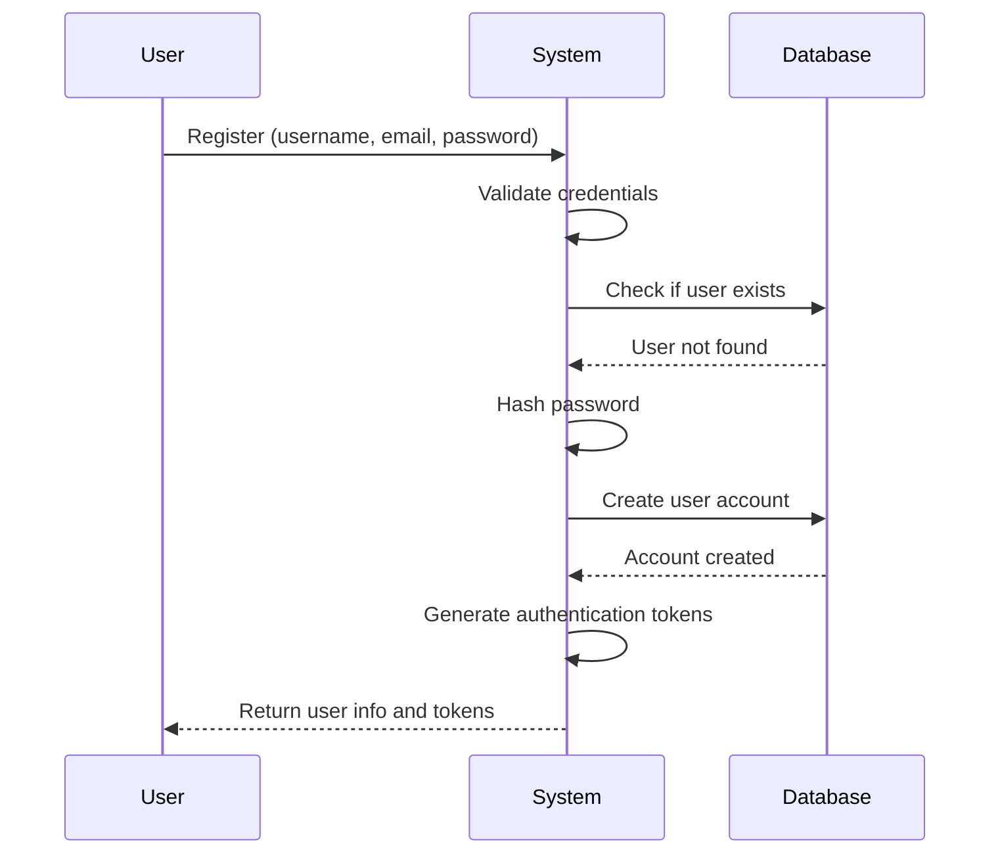
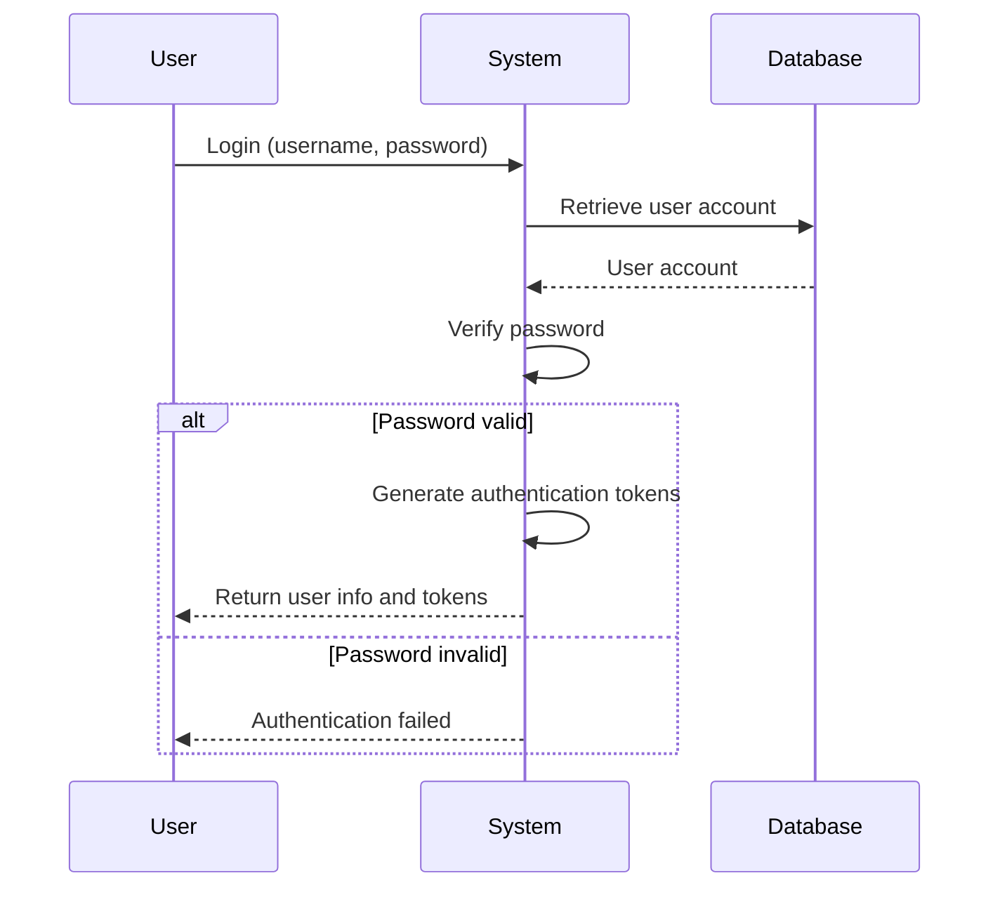
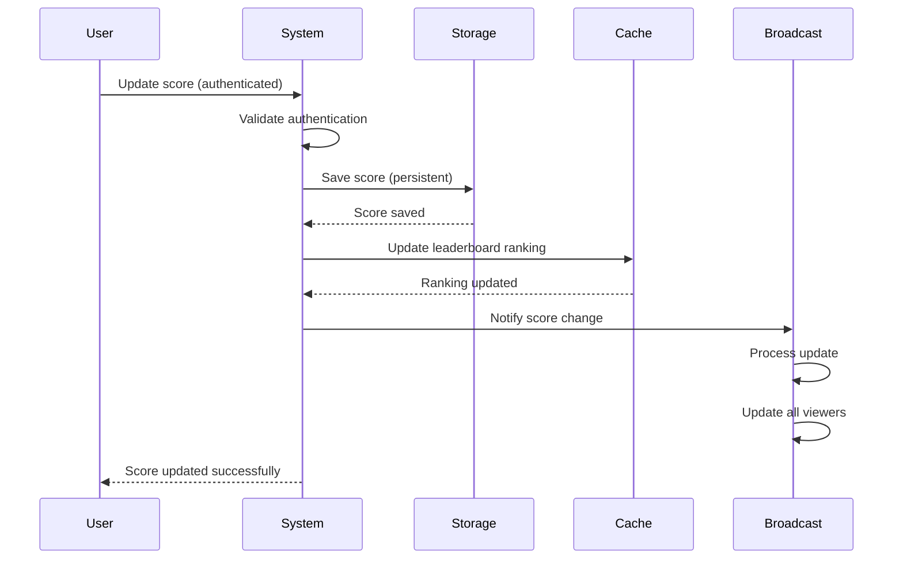
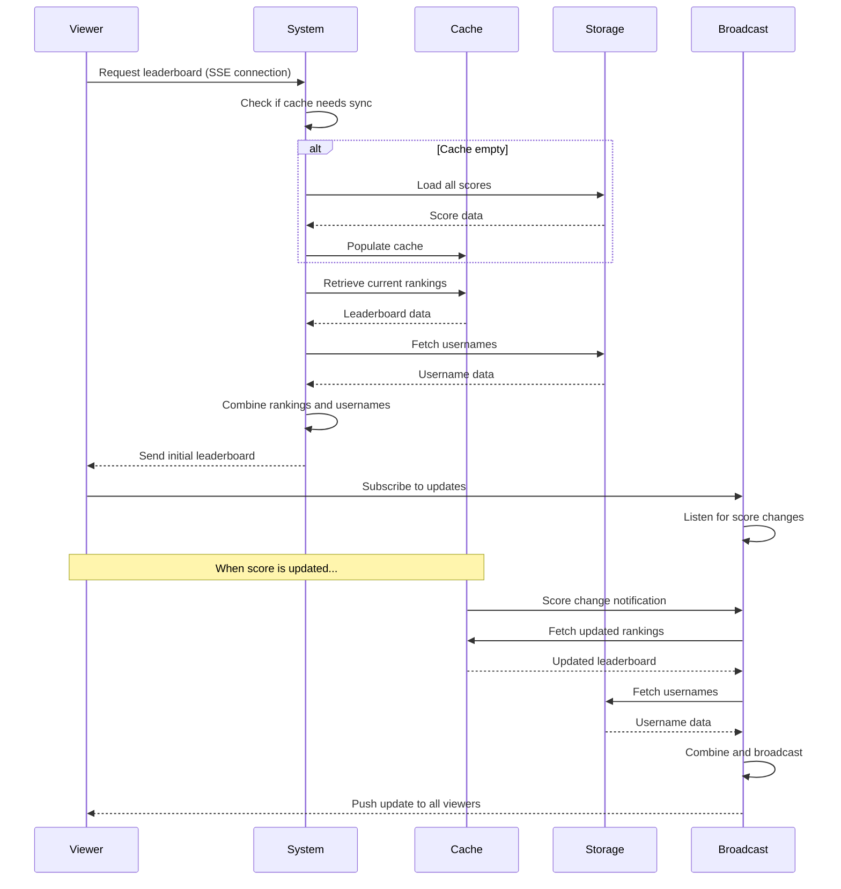

# Application Features & Flows

This document describes the application features and user flows from a high-level perspective.

## Features

### User Authentication

Users can register, login, and manage their authentication sessions using JWT tokens.

**Capabilities**:
- Register new account with username, email, and password
- Login with credentials to receive authentication tokens
- Refresh access tokens to extend sessions
- Secure password storage with hashing

### Score Management

Users can update their scores, which are automatically ranked in the leaderboard.

**Capabilities**:
- Update score via authenticated endpoint
- Automatic ranking in global leaderboard
- Scores persist across sessions
- Real-time leaderboard updates when scores change

### Real-Time Leaderboard

Users can view the current leaderboard with live updates as scores change.

**Capabilities**:
- View ranked leaderboard with usernames, scores, and ranks
- Real-time updates via Server-Sent Events (no polling)
- Configurable limit for number of entries displayed
- Automatic data recovery if cache is empty

## Application Flows

### User Registration Flow



**What Happens**:
1. User provides registration information
2. System validates and checks for existing accounts
3. Password is securely hashed
4. User account is created
5. Authentication tokens are generated
6. User receives account information and tokens

### User Login Flow



**What Happens**:
1. User provides login credentials
2. System retrieves user account
3. Password is verified
4. If valid, authentication tokens are generated and returned
5. If invalid, authentication error is returned

### Score Update Flow



**What Happens**:
1. Authenticated user submits new score
2. System validates authentication
3. Score is saved to persistent storage
4. Leaderboard ranking is updated in cache
5. Score change notification is broadcast
6. All leaderboard viewers receive update
7. User receives confirmation

### Real-Time Leaderboard Flow



**What Happens**:

1. **Initial Connection**:
   - Viewer connects to leaderboard endpoint
   - System checks if cache needs data from persistent storage
   - If cache is empty, scores are loaded from storage
   - Current rankings are retrieved from cache
   - Usernames are fetched and combined with rankings
   - Initial leaderboard is sent to viewer

2. **Real-Time Updates**:
   - Viewer subscribes to live updates
   - When any score changes:
     - Broadcast service receives notification
     - Updated rankings are fetched
     - Usernames are refreshed
     - Updated leaderboard is pushed to all connected viewers
   - Viewers receive updates automatically without polling

**Key Characteristics**:
- **Automatic Recovery**: If cache is empty, data is automatically loaded from storage
- **Real-Time**: Updates are pushed immediately when scores change
- **Efficient**: Single broadcast service updates all viewers simultaneously
- **Scalable**: Works across multiple server instances

## Data Flow Overview

### Score Update → Leaderboard Update

```
User Updates Score
    ↓
Score Saved (Persistent Storage)
    ↓
Ranking Updated (Cache)
    ↓
Change Notification Published
    ↓
Broadcast Service Processes Update
    ↓
All Viewers Receive Update
```

### Lazy Loading

```
First Leaderboard Request
    ↓
Check Cache Status
    ↓
If Empty: Load from Storage
    ↓
Populate Cache
    ↓
Return Leaderboard
```

This ensures the system automatically recovers from cache failures without manual intervention.

## API Documentation

For complete API documentation including endpoints, request/response formats, and authentication details, see:

- **OpenAPI Specification**: `api/v1/openapi.yaml` - The source of truth for API documentation
- **Swagger UI**: http://localhost:8080/docs/index.html - Interactive API documentation
- **Module Endpoints**: See [Modules](./modules.md) for endpoint listings by module
