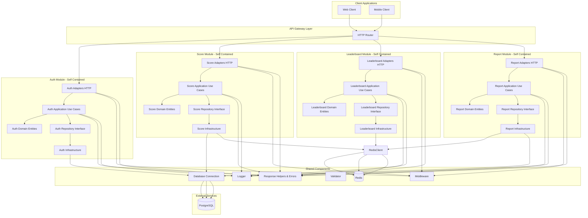
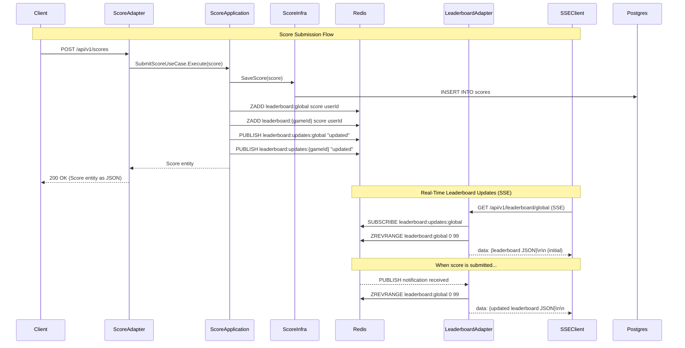

# Architecture

The system follows **Clean Architecture** principles with clear layer separation:

- **Domain Layer**: Core entities and repository interfaces (no dependencies)
- **Application Layer**: Use cases and business logic orchestration
- **Adapters Layer**: HTTP handlers (input adapters)
- **Infrastructure Layer**: Repository implementations, external services (output adapters)

## System Architecture Diagram

## Data Flow Example

### Score Submission and Real-Time Leaderboard Updates

**Key Points**:
- Score module updates Redis sorted sets and publishes notifications
- Leaderboard SSE handlers subscribe to Redis pub/sub channels
- No polling - updates are pushed immediately when scores change
- No cross-module dependencies - communication via Redis (shared infrastructure)

### Detailed Flow

1. **Score Submission**:
   - User submits score via `POST /api/v1/scores`
   - Score is saved to PostgreSQL for historical records
   - Score is added/updated in Redis sorted sets (`ZADD` command)
   - Notification is published to Redis pub/sub channels (`PUBLISH` command)

2. **Real-Time Updates**:
   - SSE clients connect to leaderboard endpoints (`GET /api/v1/leaderboard/global` or `/game/:game_id`)
   - SSE handlers subscribe to corresponding Redis pub/sub channels (`SUBSCRIBE` command)
   - Initial leaderboard data is fetched from Redis and sent to client
   - When a notification is received from pub/sub:
     - Handler fetches fresh leaderboard data from Redis sorted sets (`ZREVRANGE` command)
     - Updated leaderboard is sent to client via SSE (`data: {json}\n\n` format)

3. **Benefits**:
   - **Real-time**: Updates pushed immediately when scores change (no polling delay)
   - **Efficient**: Only fetches data when there's an actual update
   - **Decoupled**: Score and leaderboard modules communicate via Redis (shared infrastructure)
   - **Scalable**: Works across multiple server instances - all instances receive pub/sub notifications

## Architecture Principles

### Clean Architecture Layers

Each module follows Clean Architecture with four distinct layers:

1. **Domain Layer** (`domain/`): Contains core business entities and repository interfaces. This layer has no external dependencies and represents the business rules.

2. **Application Layer** (`application/`): Contains use cases that orchestrate business logic. It depends only on the domain layer and defines interfaces for infrastructure.

3. **Adapters Layer** (`adapters/`): Contains HTTP handlers that translate external requests into domain entities and use cases. This is the input adapter layer.

4. **Infrastructure Layer** (`infrastructure/`): Contains implementations of repositories and external service integrations (database, Redis, etc.). This is the output adapter layer.

### Module Independence

Each module (auth, score, leaderboard, report) is self-contained with its own:
- Domain entities and business rules
- Use cases and application logic
- HTTP adapters
- Infrastructure implementations

This design allows each module to be extracted into a separate microservice if needed. See [Microservice Migration Guide](./microservice-migration.md) for details.

### Shared Components

The `internal/shared/` directory contains cross-cutting concerns used by all modules:
- **Response**: Standardized API responses and error handling
- **Middleware**: HTTP middleware (authentication, logging, recovery)
- **Logger**: Centralized logging
- **Validator**: Request validation utilities
- **Database**: PostgreSQL connection and migrations
- **Redis**: Redis client connection

These shared components follow the dependency inversion principle - modules depend on abstractions, not concrete implementations.

