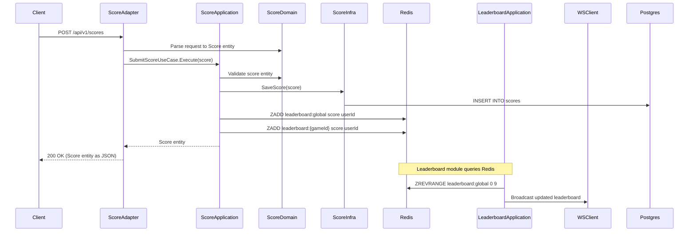

# Architecture

The system follows **Clean Architecture** principles with clear layer separation:

- **Domain Layer**: Core entities and repository interfaces (no dependencies)
- **Application Layer**: Use cases and business logic orchestration
- **Adapters Layer**: HTTP/WebSocket handlers (input adapters)
- **Infrastructure Layer**: Repository implementations, external services (output adapters)

## System Architecture Diagram

```mermaid
graph TB
    subgraph client[Client Applications]
        WebClient[Web Client]
        MobileClient[Mobile Client]
    end
    
    subgraph api[API Gateway Layer]
        Router[HTTP Router]
        WSRouter[WebSocket Router]
    end
    
    subgraph authModule[Auth Module - Self Contained]
        AuthAdapter[Auth Adapters HTTP]
        AuthApplication[Auth Application Use Cases]
        AuthDomain[Auth Domain Entities]
        AuthDomainRepo[Auth Repository Interface]
        AuthInfra[Auth Infrastructure]
    end
    
    subgraph scoreModule[Score Module - Self Contained]
        ScoreAdapter[Score Adapters HTTP]
        ScoreApplication[Score Application Use Cases]
        ScoreDomain[Score Domain Entities]
        ScoreDomainRepo[Score Repository Interface]
        ScoreInfra[Score Infrastructure]
    end
    
    subgraph leaderboardModule[Leaderboard Module - Self Contained]
        LeaderboardAdapter[Leaderboard Adapters HTTP/WS]
        LeaderboardApplication[Leaderboard Application Use Cases]
        LeaderboardDomain[Leaderboard Domain Entities]
        LeaderboardDomainRepo[Leaderboard Repository Interface]
        LeaderboardInfra[Leaderboard Infrastructure]
    end
    
    subgraph reportModule[Report Module - Self Contained]
        ReportAdapter[Report Adapters HTTP]
        ReportApplication[Report Application Use Cases]
        ReportDomain[Report Domain Entities]
        ReportDomainRepo[Report Repository Interface]
        ReportInfra[Report Infrastructure]
    end
    
    subgraph shared[Shared Components]
        Errors[Error Definitions]
        Response[Response Helpers]
        Middleware[Middleware]
        Logger[Logger]
        Validator[Validator]
        Database[Database Connection]
        Redis[Redis Connection]
    end
    
    subgraph infra[External Services]
        Postgres[(PostgreSQL)]
        Redis[(Redis)]
    end
    
    WebClient --> Router
    MobileClient --> Router
    WebClient --> WSRouter
    
    Router --> AuthAdapter
    Router --> ScoreAdapter
    Router --> LeaderboardAdapter
    Router --> ReportAdapter
    WSRouter --> LeaderboardAdapter
    
    AuthAdapter --> AuthApplication
    AuthApplication --> AuthDomain
    AuthApplication --> AuthDomainRepo
    AuthDomainRepo --> AuthInfra
    AuthInfra --> Database
    Database --> Postgres
    
    ScoreAdapter --> ScoreApplication
    ScoreApplication --> ScoreDomain
    ScoreApplication --> ScoreDomainRepo
    ScoreDomainRepo --> ScoreInfra
    ScoreInfra --> Database
    ScoreInfra --> RedisClient
    Database --> Postgres
    RedisClient --> Redis
    
    LeaderboardAdapter --> LeaderboardApplication
    LeaderboardApplication --> LeaderboardDomain
    LeaderboardApplication --> LeaderboardDomainRepo
    LeaderboardDomainRepo --> LeaderboardInfra
    LeaderboardInfra --> RedisClient
    RedisClient --> Redis
    
    ReportAdapter --> ReportApplication
    ReportApplication --> ReportDomain
    ReportApplication --> ReportDomainRepo
    ReportDomainRepo --> ReportInfra
    ReportInfra --> RedisClient
    ReportInfra --> Database
    RedisClient --> Redis
    Database --> Postgres
    
    AuthAdapter --> Middleware
    ScoreAdapter --> Middleware
    LeaderboardAdapter --> Middleware
    ReportAdapter --> Middleware
    
    AuthApplication --> Errors
    ScoreApplication --> Errors
    LeaderboardApplication --> Errors
    ReportApplication --> Errors
    
    AuthAdapter --> Response
    ScoreAdapter --> Response
    LeaderboardAdapter --> Response
    ReportAdapter --> Response
    
    AuthApplication --> Logger
    ScoreApplication --> Logger
    LeaderboardApplication --> Logger
    ReportApplication --> Logger
```



## Data Flow Example



## Project Structure

```
real-time-leaderboard/
├── cmd/
│   └── server/
│       └── main.go                 # Application entry point
├── internal/
│   ├── config/                     # Configuration management
│   │   └── config.go
│   ├── shared/                     # Shared utilities and infrastructure
│   │   ├── errors/                # Error definitions
│   │   ├── response/               # API response helpers
│   │   ├── middleware/             # HTTP middleware
│   │   ├── logger/                 # Logger implementation
│   │   ├── validator/              # Request validation
│   │   ├── database/               # Database connections
│   │   │   └── migrations/        # Database migrations
│   │   └── redis/                  # Redis connections
│   └── module/                     # Self-contained modules
│       ├── auth/                   # Auth Module
│       │   ├── domain/            # Domain layer
│       │   ├── application/       # Application layer
│       │   ├── adapters/          # Adapters layer
│       │   └── infrastructure/    # Infrastructure layer
│       ├── score/                  # Score Module
│       ├── leaderboard/            # Leaderboard Module
│       └── report/                 # Report Module
├── scripts/                        # Utility scripts
│   ├── init.sh                    # Initialize development environment
│   ├── run.sh                     # Application startup script (dev/all modes)
│   └── migrate.sh                 # Database migration tool
├── docker/
│   ├── Dockerfile                 # Production Docker image
│   ├── docker-compose.deps.yml    # Dependency services (postgres, redis)
│   └── docker-compose.yml         # Full compose file (includes deps + app)
├── .env.example
├── go.mod
├── Makefile                       # Development commands
└── README.md
```

