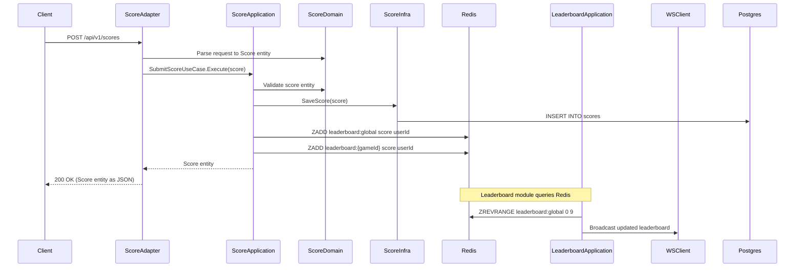

# Architecture

The system follows **Clean Architecture** principles with clear layer separation:

- **Domain Layer**: Core entities and repository interfaces (no dependencies)
- **Application Layer**: Use cases and business logic orchestration
- **Adapters Layer**: HTTP/WebSocket handlers (input adapters)
- **Infrastructure Layer**: Repository implementations, external services (output adapters)

## System Architecture Diagram

```mermaid
graph TB
    subgraph client[Client Applications]
        WebClient[Web Client]
        MobileClient[Mobile Client]
    end
    
    subgraph api[API Gateway Layer]
        Router[HTTP Router]
        WSRouter[WebSocket Router]
    end
    
    subgraph authModule[Auth Module - Self Contained]
        AuthAdapter[Auth Adapters HTTP]
        AuthApplication[Auth Application Use Cases]
        AuthDomain[Auth Domain Entities]
        AuthDomainRepo[Auth Repository Interface]
        AuthInfra[Auth Infrastructure]
    end
    
    subgraph scoreModule[Score Module - Self Contained]
        ScoreAdapter[Score Adapters HTTP]
        ScoreApplication[Score Application Use Cases]
        ScoreDomain[Score Domain Entities]
        ScoreDomainRepo[Score Repository Interface]
        ScoreInfra[Score Infrastructure]
    end
    
    subgraph leaderboardModule[Leaderboard Module - Self Contained]
        LeaderboardAdapter[Leaderboard Adapters HTTP/WS]
        LeaderboardApplication[Leaderboard Application Use Cases]
        LeaderboardDomain[Leaderboard Domain Entities]
        LeaderboardDomainRepo[Leaderboard Repository Interface]
        LeaderboardInfra[Leaderboard Infrastructure]
    end
    
    subgraph reportModule[Report Module - Self Contained]
        ReportAdapter[Report Adapters HTTP]
        ReportApplication[Report Application Use Cases]
        ReportDomain[Report Domain Entities]
        ReportDomainRepo[Report Repository Interface]
        ReportInfra[Report Infrastructure]
    end
    
    subgraph shared[Shared Components]
        Response[Response Helpers & Errors]
        Middleware[Middleware]
        Logger[Logger]
        Validator[Validator]
        Database[Database Connection]
        Redis[Redis Connection]
    end
    
    subgraph infra[External Services]
        Postgres[(PostgreSQL)]
        Redis[(Redis)]
    end
    
    WebClient --> Router
    MobileClient --> Router
    WebClient --> WSRouter
    
    Router --> AuthAdapter
    Router --> ScoreAdapter
    Router --> LeaderboardAdapter
    Router --> ReportAdapter
    WSRouter --> LeaderboardAdapter
    
    AuthAdapter --> AuthApplication
    AuthApplication --> AuthDomain
    AuthApplication --> AuthDomainRepo
    AuthDomainRepo --> AuthInfra
    AuthInfra --> Database
    Database --> Postgres
    
    ScoreAdapter --> ScoreApplication
    ScoreApplication --> ScoreDomain
    ScoreApplication --> ScoreDomainRepo
    ScoreDomainRepo --> ScoreInfra
    ScoreInfra --> Database
    ScoreInfra --> RedisClient
    Database --> Postgres
    RedisClient --> Redis
    
    LeaderboardAdapter --> LeaderboardApplication
    LeaderboardApplication --> LeaderboardDomain
    LeaderboardApplication --> LeaderboardDomainRepo
    LeaderboardDomainRepo --> LeaderboardInfra
    LeaderboardInfra --> RedisClient
    RedisClient --> Redis
    
    ReportAdapter --> ReportApplication
    ReportApplication --> ReportDomain
    ReportApplication --> ReportDomainRepo
    ReportDomainRepo --> ReportInfra
    ReportInfra --> RedisClient
    ReportInfra --> Database
    RedisClient --> Redis
    Database --> Postgres
    
    AuthAdapter --> Middleware
    ScoreAdapter --> Middleware
    LeaderboardAdapter --> Middleware
    ReportAdapter --> Middleware
    
    AuthApplication --> Response
    ScoreApplication --> Response
    LeaderboardApplication --> Response
    ReportApplication --> Response
    
    AuthAdapter --> Response
    ScoreAdapter --> Response
    LeaderboardAdapter --> Response
    ReportAdapter --> Response
    
    AuthApplication --> Logger
    ScoreApplication --> Logger
    LeaderboardApplication --> Logger
    ReportApplication --> Logger
```

## Data Flow Example

## Architecture Principles

### Clean Architecture Layers

Each module follows Clean Architecture with four distinct layers:

1. **Domain Layer** (`domain/`): Contains core business entities and repository interfaces. This layer has no external dependencies and represents the business rules.

2. **Application Layer** (`application/`): Contains use cases that orchestrate business logic. It depends only on the domain layer and defines interfaces for infrastructure.

3. **Adapters Layer** (`adapters/`): Contains HTTP/WebSocket handlers that translate external requests into domain entities and use cases. This is the input adapter layer.

4. **Infrastructure Layer** (`infrastructure/`): Contains implementations of repositories and external service integrations (database, Redis, etc.). This is the output adapter layer.

### Module Independence

Each module (auth, score, leaderboard, report) is self-contained with its own:
- Domain entities and business rules
- Use cases and application logic
- HTTP/WebSocket adapters
- Infrastructure implementations

This design allows each module to be extracted into a separate microservice if needed. See [Microservice Migration Guide](./microservice-migration.md) for details.

### Shared Components

The `internal/shared/` directory contains cross-cutting concerns used by all modules:
- **Response**: Standardized API responses and error handling
- **Middleware**: HTTP middleware (authentication, logging, recovery)
- **Logger**: Centralized logging
- **Validator**: Request validation utilities
- **Database**: PostgreSQL connection and migrations
- **Redis**: Redis client connection

These shared components follow the dependency inversion principle - modules depend on abstractions, not concrete implementations.

