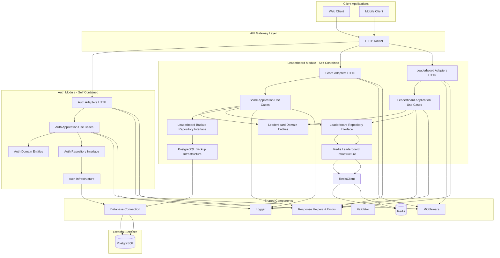
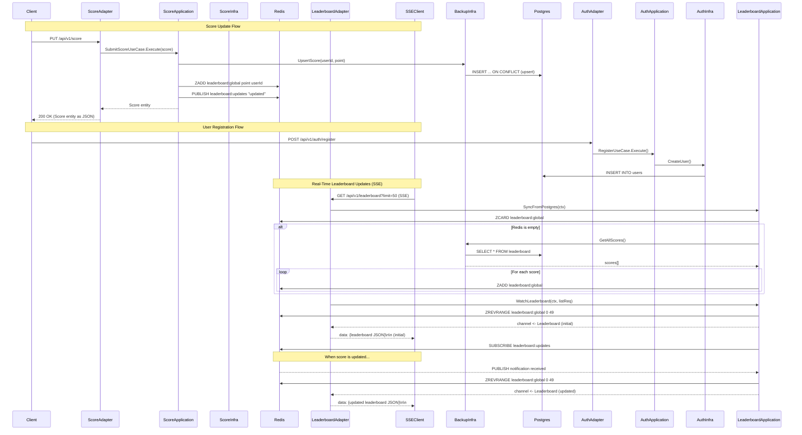

# Architecture

The system follows **Clean Architecture** principles with clear layer separation:

- **Domain Layer**: Core entities and repository interfaces (no dependencies)
- **Application Layer**: Use cases and business logic orchestration
- **Adapters Layer**: HTTP handlers (input adapters)
- **Infrastructure Layer**: Repository implementations, external services (output adapters)

## System Architecture Diagram

## Data Flow Example

### Score Update and Real-Time Leaderboard Updates

**Key Points**:
- Score update upserts in PostgreSQL and updates Redis sorted sets, then publishes notifications
- Leaderboard SSE handlers subscribe to Redis pub/sub channel
- No polling - updates are pushed immediately when scores change
- Single leaderboard - no game-specific separation

### Detailed Flow

1. **User Registration**:
   - User registers via `POST /api/v1/auth/register`
   - User record is created in PostgreSQL

2. **Score Update**:
   - User updates score via `PUT /api/v1/score`
   - System upserts score in PostgreSQL (creates if not exists, updates if exists)
     - PostgreSQL serves as backup/recovery mechanism for Redis
     - Uses UPSERT pattern to handle both new and existing users automatically
   - Score is updated in Redis sorted sets (`ZADD` command)
   - Notification is published to Redis pub/sub channel (`PUBLISH leaderboard:updates`)

3. **Real-Time Updates**:
   - SSE clients connect to leaderboard endpoint (`GET /api/v1/leaderboard?limit=50`)
   - Handler calls `SyncFromPostgres()` for lazy loading - syncs PostgreSQL data to Redis if Redis is empty
   - Handler calls `WatchLeaderboard()` which:
     - Fetches initial leaderboard from Redis and sends to channel
     - Subscribes to Redis pub/sub channel (`SUBSCRIBE leaderboard:updates`) in application layer
     - On each pub/sub notification, fetches fresh leaderboard and sends to channel
   - Handler reads from channel and streams to client via SSE (`data: {json}\n\n` format)
   - Handler only manages SSE connection lifecycle - all business logic is in application layer

### Data Storage Strategy

- **PostgreSQL**: Stores one record per user with their current score
  - Uses UPSERT pattern - creates record if user doesn't exist, updates if exists
  - Serves as backup/recovery mechanism if Redis data is lost
  - Can be queried to rebuild Redis leaderboard if needed
  - **Lazy Loading**: On first leaderboard request, if Redis is empty, data is automatically synced from PostgreSQL

- **Redis**: Stores leaderboard in sorted sets for efficient real-time queries
  - Primary source of truth for leaderboard rankings
  - Provides O(log(N)) complexity for insertions and range queries
  - Automatically populated from PostgreSQL on first request if empty (lazy loading)
  - See [Redis Strategy](./redis-strategy.md) for detailed implementation

### Benefits

- **Real-time**: Updates pushed immediately when scores change (no polling delay)
- **Efficient**: Only fetches data when there's an actual update
- **Scalable**: Works across multiple server instances - all instances receive pub/sub notifications
- **Durable**: PostgreSQL backup ensures data can be recovered if Redis fails

## Architecture Principles

### Clean Architecture Layers

Each module follows Clean Architecture with four distinct layers:

1. **Domain Layer** (`domain/`): Contains core business entities and repository interfaces. This layer has no external dependencies and represents the business rules.

2. **Application Layer** (`application/`): Contains use cases that orchestrate business logic. It depends only on the domain layer and defines interfaces for infrastructure.

3. **Adapters Layer** (`adapters/`): Contains HTTP handlers that translate external requests into domain entities and use cases. This is the input adapter layer.

4. **Infrastructure Layer** (`infrastructure/`): Contains implementations of repositories and external service integrations (database, Redis, etc.). This is the output adapter layer.

### Module Independence

Each module (auth, leaderboard) is self-contained with its own:
- Domain entities and business rules
- Use cases and application logic
- HTTP adapters
- Infrastructure implementations

The leaderboard module combines score update and leaderboard retrieval functionality. This design allows each module to be extracted into a separate microservice if needed. See [Microservice Migration Guide](./microservice-migration.md) for details.

### Shared Components

The `internal/shared/` directory contains cross-cutting concerns used by all modules:
- **Response**: Standardized API responses and error handling
- **Middleware**: HTTP middleware (authentication, logging, recovery)
- **Logger**: Centralized logging
- **Validator**: Request validation utilities
- **Database**: PostgreSQL connection and migrations
- **Redis**: Redis client connection

These shared components follow the dependency inversion principle - modules depend on abstractions, not concrete implementations.

