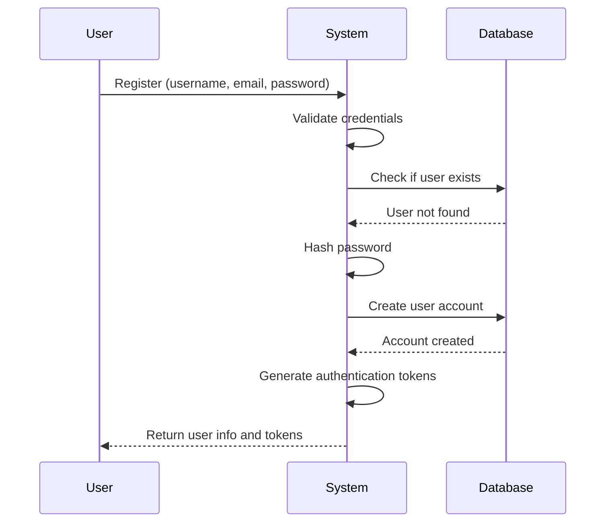
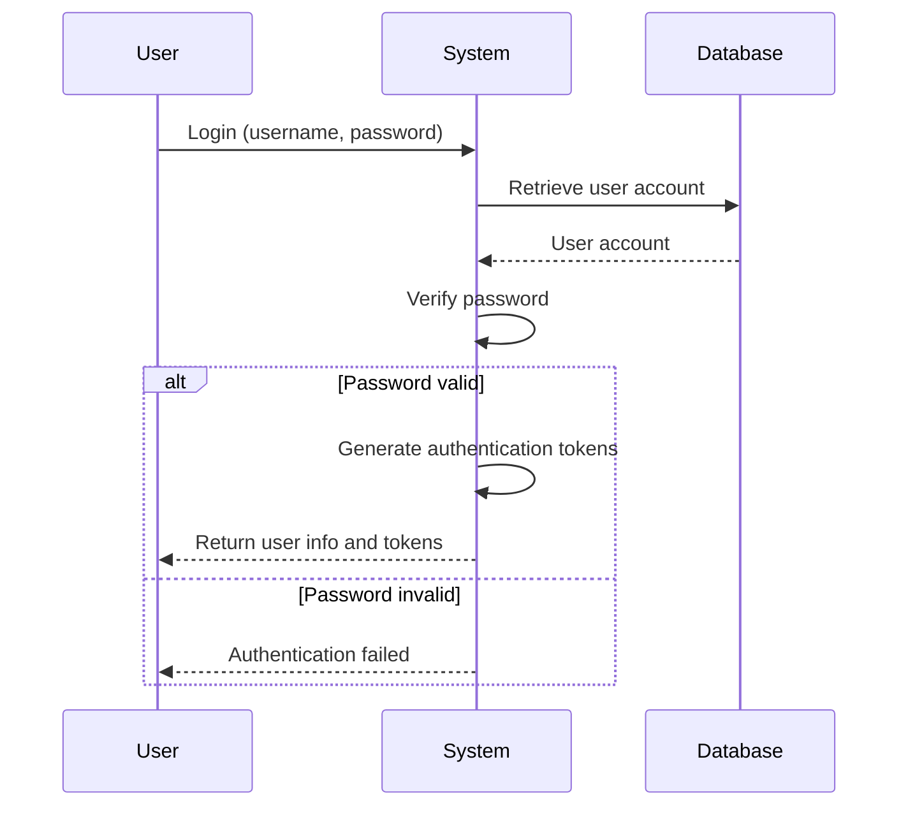
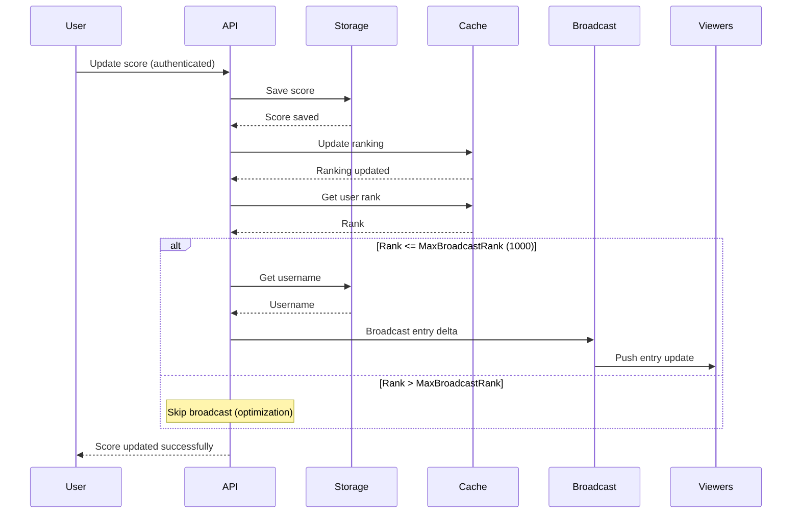
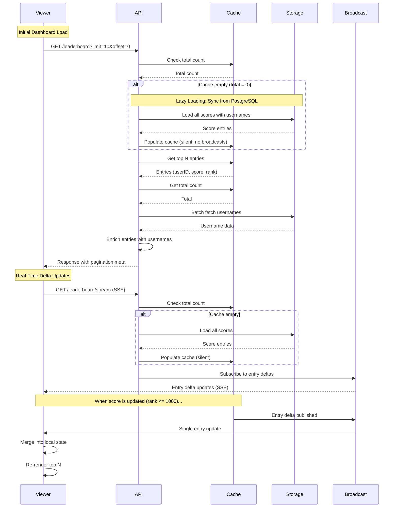

# Modules

The system is organized into self-contained modules, each following Clean Architecture principles.

For general application features and high-level flows, see [Application Features & Flows](./application.md).

## Auth Module

**Purpose**: User authentication and authorization

**Components**:
- **Domain**: User entity
- **Application**: UserRepository interface, RegisterUseCase, LoginUseCase, ValidateTokenUseCase, RefreshTokenUseCase, GetCurrentUserUseCase
- **Adapters**: HTTP handlers for registration, login, token refresh, and current user info
  - `RegisterPublicRoutes()` - Registers public routes (register, login, refresh)
  - `RegisterProtectedRoutes()` - Registers protected routes (get current user)
- **Infrastructure**: PostgreSQL UserRepository, JWT token manager

**Endpoints**:
- `POST /api/v1/auth/register` - User registration (public)
- `POST /api/v1/auth/login` - User login (public)
- `POST /api/v1/auth/refresh` - Refresh access token (public)
- `GET /api/v1/auth/me` - Get current user information (protected, requires authentication)

### User Registration Flow

**What Happens**:
1. User provides registration information
2. System validates and checks for existing accounts
3. Password is securely hashed
4. User account is created
5. Authentication tokens are generated
6. User receives account information and tokens

### User Login Flow

**What Happens**:
1. User provides login credentials
2. System retrieves user account
3. Password is verified
4. If valid, authentication tokens are generated and returned
5. If invalid, authentication error is returned

### Token Management

The system implements JWT-based authentication with automatic token management:

**Token Types**:
- **Access Token**: Short-lived token for API authentication (validated on every request)
- **Refresh Token**: Long-lived token for obtaining new access tokens

**Token Management Features**:
- **Proactive Refresh**: Tokens are automatically refreshed before expiration (configurable buffer time, default: 5 minutes)
- **Expiration Checking**: Token expiration is checked before making API requests
- **Automatic Retry**: Failed requests due to expired tokens are automatically retried after refresh
- **Secure Storage**: Tokens are stored securely in browser localStorage (SPA)
- **User Info Management**: User information is stored separately from tokens (no client-side JWT decoding)

**Current User Endpoint**:
- `GET /api/v1/auth/me` - Returns current authenticated user's information
- Requires valid JWT token in Authorization header
- Provides single source of truth for user information
- Used by SPA to fetch user info without decoding JWT tokens

**SPA Authentication Best Practices**:
- No client-side JWT decoding for user data extraction
- User information retrieved from API endpoints only
- Automatic token refresh prevents failed requests
- Proper error handling for authentication failures
- Token validation on all protected endpoints

## Leaderboard Module

**Purpose**: Score update and real-time leaderboard queries via Server-Sent Events (SSE)

**Components**:
- **Domain**: 
  - `LeaderboardEntry` (user_id, username, score, rank)
  - Domain constants (Redis keys, topics, MaxBroadcastRank)
- **Application**: 
  - `LeaderboardPersistenceRepository` interface - Persistent storage in PostgreSQL
  - `LeaderboardCacheRepository` interface - Cache storage in Redis
  - `UserRepository` interface (module-owned, not from auth module)
  - `BroadcastService` interface - For real-time leaderboard entry delta broadcasting
  - `ScoreUseCase` - Updates score in persistence and cache, broadcasts entry delta updates
  - `LeaderboardUseCase` - Handles leaderboard queries and enrichment:
    - `SyncFromPostgres()` - Lazy loading from PostgreSQL to Redis
    - `GetFullLeaderboard()` - Fetches full leaderboard and enriches with usernames
    - `GetLeaderboard()` - Fetches paginated leaderboard with usernames
    - `SubscribeToEntryUpdates()` - Provides subscription channel for entry delta updates
- **Adapters**: 
  - `LeaderboardHandler` - HTTP handler for score update and leaderboard retrieval
    - `RegisterPublicRoutes()` - Registers public routes (GET /leaderboard, SSE stream)
    - `RegisterProtectedRoutes()` - Registers protected routes (score submission)
- **Infrastructure**: 
  - PostgreSQL `LeaderboardPersistenceRepository` - Stores scores persistently, `GetLeaderboard()` with username JOIN
  - Redis `LeaderboardCacheRepository` - Sorted sets for real-time queries
  - PostgreSQL `UserRepository` - Batch username fetching for leaderboard module
  - Redis `BroadcastService` (`RedisBroadcastService`) - Implements pub/sub for entry delta updates

**Endpoints**:
- `GET /api/v1/leaderboard?limit=10&offset=0` - Get paginated leaderboard (for initial dashboard load)
- `GET /api/v1/leaderboard/stream` - SSE stream for real-time entry delta updates
- `PUT /api/v1/leaderboard/score` - Update score (authenticated)

**Module Independence**: Owns its `UserRepository` interface (no dependency on auth module). For details on module independence, see [Architecture - Module Independence](./architecture.md#module-independence).

### Score Update Flow

**What Happens**:
1. Authenticated user submits new score
2. Score is saved to persistent storage (PostgreSQL)
3. Leaderboard ranking is updated in cache (Redis)
4. System gets user's rank after update
5. **Optimization**: If rank is within `MaxBroadcastRank` (1000), system:
   - Fetches username
   - Creates entry delta update (includes `user_id`, `username`, `score`, and `rank`)
   - Broadcasts single entry update via pub/sub
6. All connected viewers receive the entry delta update via SSE
7. Viewers process the update:
   - Use the `rank` from the event message (authoritative from backend)
   - If `rank > limit`: Remove entry and reload leaderboard from backend
   - Otherwise: Update entry in local state and re-render
8. User receives confirmation

**Optimization**: Entries ranked outside the top 1000 are not broadcasted to reduce network traffic, as they are unlikely to be relevant to any client viewing top N leaderboards.

### Leaderboard Viewing Flow

**What Happens**:

1. **Initial Dashboard Load**:
   1. Client calls `GET /leaderboard` with pagination
   2. System checks if cache is empty (lazy loading check)
   3. If cache is empty:
      - System loads all scores from PostgreSQL (includes usernames via JOIN)
      - Only scores (userID + score) are populated into Redis cache (usernames not stored in Redis)
      - Cache updates are silent (no broadcasts triggered)
   4. Top N entries are retrieved from cache (userID, score, rank - no username)
   5. Total count is retrieved from cache
   6. Usernames are batch fetched from storage and entries are enriched
   7. Response includes entries array and pagination metadata (total, page, etc.)

2. **Real-Time Delta Updates**:
   1. Client connects to SSE stream (`GET /leaderboard/stream`)
   2. System syncs from persistence if cache is empty (same lazy loading as above)
   3. Client subscribes to entry delta updates via broadcast service
   4. When a score is updated (and rank <= 1000):
      - Single entry delta update is broadcasted via Redis pub/sub
      - All subscribed clients receive the entry update via SSE
      - Each entry update includes: `user_id`, `username`, `score`, and `rank` (authoritative from backend)
      - Clients process the update:
        - If `entry.rank > limit`: Entry is outside top N, remove from local state and reload leaderboard from backend
        - Otherwise: Update entry in local state and re-render top N
      - This ensures entries that fall out of the top N are automatically removed
   5. Updates are automatic without polling

**Key Characteristics**:
- **Automatic Recovery**: If cache is empty, data is automatically loaded from storage (lazy loading)
- **Real-Time**: Updates are pushed immediately when scores change (rank <= 1000)
- **Efficient**: Single broadcast updates all viewers simultaneously via Redis pub/sub
- **Scalable**: Works across multiple server instances
- **Delta Updates**: Only single entry changes are broadcasted, not full leaderboard
- **Optimized**: Entries ranked > 1000 are not broadcasted (reduces network traffic)

### Infrastructure Implementation Details

#### Redis Storage Strategy

**Sorted Sets for Leaderboard Storage**:
- Key: `leaderboard:global` (single global leaderboard)
- Score: User's total score (as Redis score)
- Member: User ID
- Commands: `ZADD` (update/add), `ZREVRANGE` (get top N), `ZCARD` (total players)
- Performance: O(log(N)) complexity for insertions, O(log(N)+M) for range queries
- All operations are atomic, no application-level locking needed

**Pub/Sub for Real-Time Notifications**:
- Viewer Update Topic: `leaderboard:viewer:updates` - Published with single entry delta updates (LeaderboardEntry JSON)
- MaxBroadcastRank: 1000 - Only entries ranked within top 1000 trigger broadcasts (optimization)
- Infrastructure layer handles all Redis pub/sub connection management

**Optimization**: The system only broadcasts updates for entries ranked within the top 1000. This reduces network traffic for very low-ranked entries while still covering all typical client limits (top 5, 10, 50, 100).
