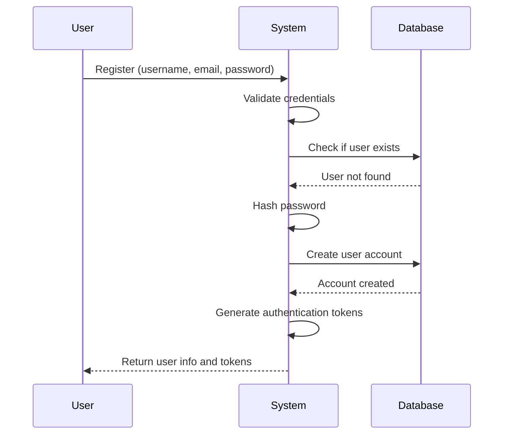
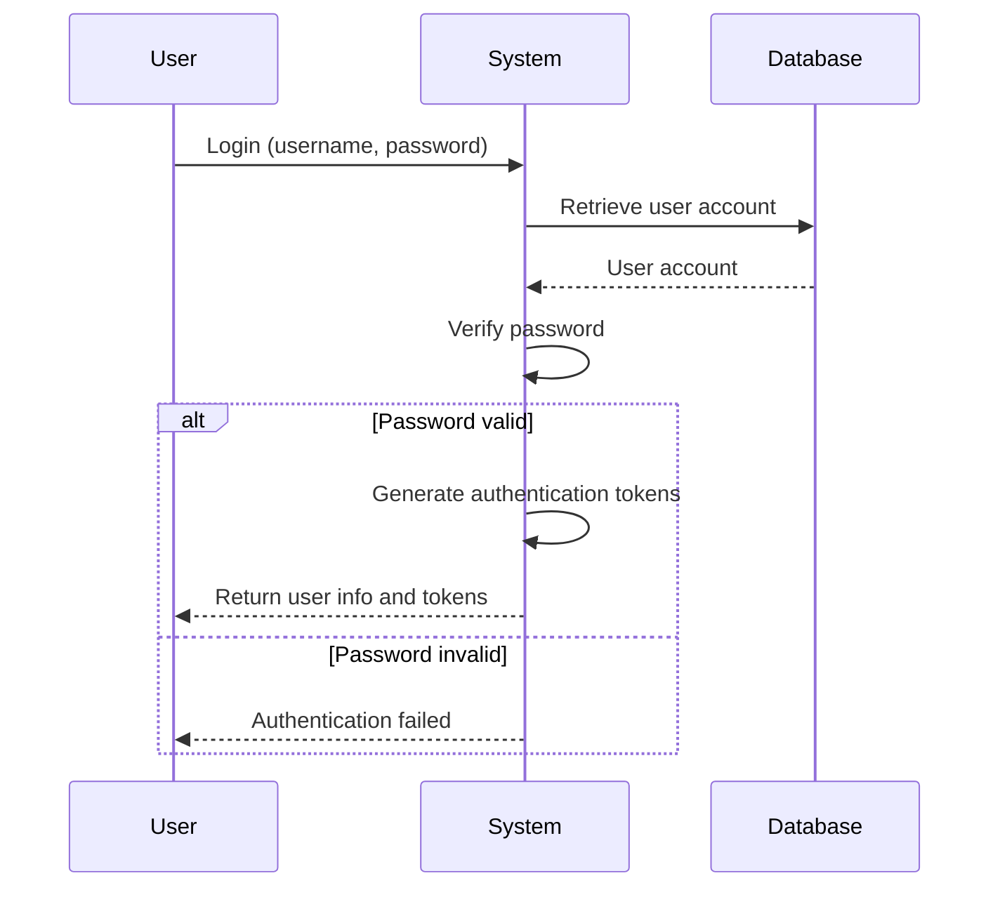
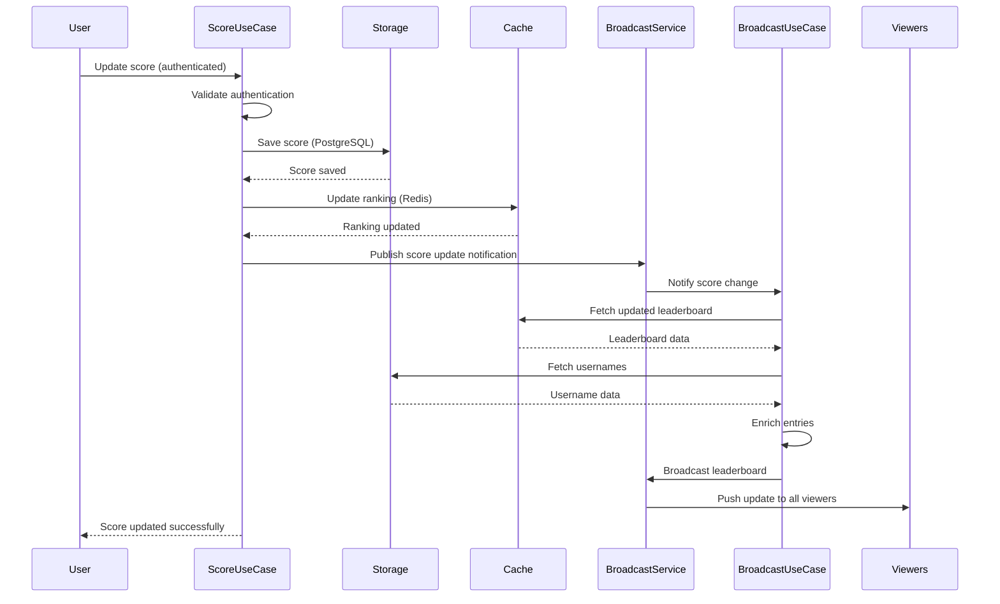
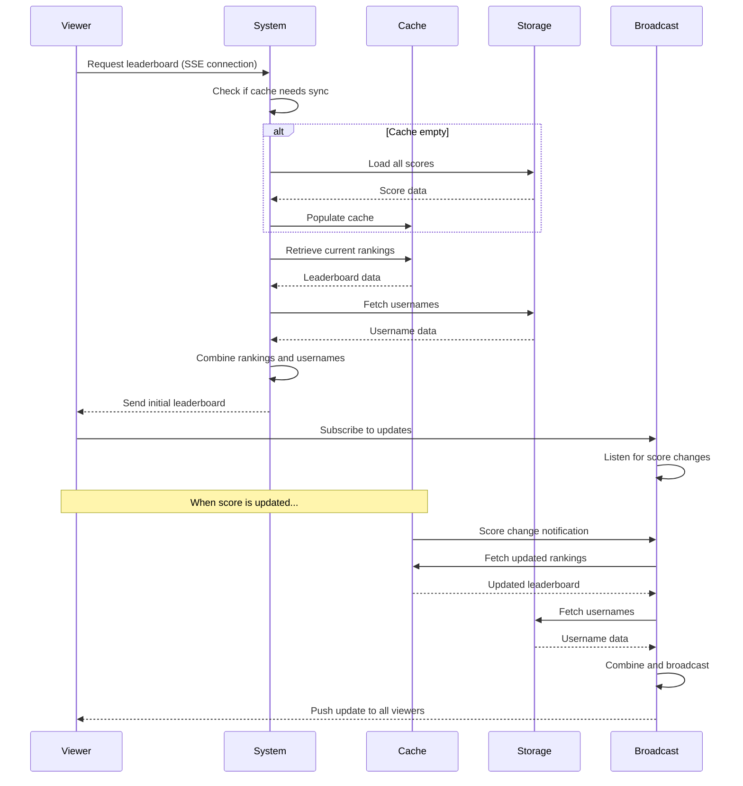
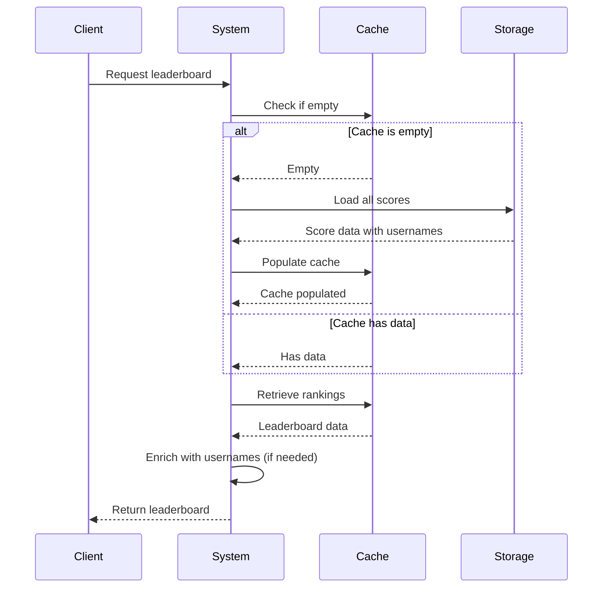
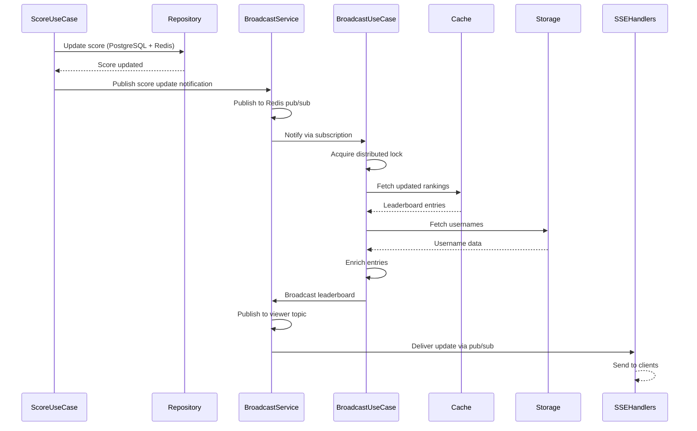
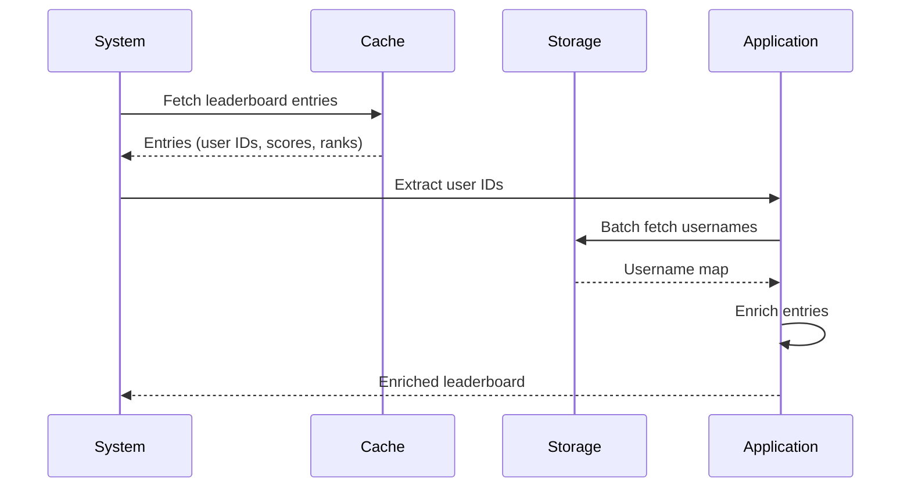

# Modules

The system is organized into self-contained modules, each following Clean Architecture principles.

For general application features and high-level flows, see [Application Features & Flows](./application.md).

## Auth Module

**Purpose**: User authentication and authorization

**Components**:
- **Domain**: User entity
- **Application**: UserRepository interface, RegisterUseCase, LoginUseCase, ValidateTokenUseCase, RefreshTokenUseCase, GetCurrentUserUseCase
- **Adapters**: HTTP handlers for registration, login, token refresh, and current user info
  - `RegisterPublicRoutes()` - Registers public routes (register, login, refresh)
  - `RegisterProtectedRoutes()` - Registers protected routes (get current user)
- **Infrastructure**: PostgreSQL UserRepository, JWT token manager

**Endpoints**:
- `POST /api/v1/auth/register` - User registration (public)
- `POST /api/v1/auth/login` - User login (public)
- `POST /api/v1/auth/refresh` - Refresh access token (public)
- `GET /api/v1/auth/me` - Get current user information (protected, requires authentication)

### User Registration Flow

**What Happens**:
1. User provides registration information
2. System validates and checks for existing accounts
3. Password is securely hashed
4. User account is created
5. Authentication tokens are generated
6. User receives account information and tokens

### User Login Flow

**What Happens**:
1. User provides login credentials
2. System retrieves user account
3. Password is verified
4. If valid, authentication tokens are generated and returned
5. If invalid, authentication error is returned

### Token Management

The system implements JWT-based authentication with automatic token management:

**Token Types**:
- **Access Token**: Short-lived token for API authentication (validated on every request)
- **Refresh Token**: Long-lived token for obtaining new access tokens

**Token Management Features**:
- **Proactive Refresh**: Tokens are automatically refreshed before expiration (configurable buffer time, default: 5 minutes)
- **Expiration Checking**: Token expiration is checked before making API requests
- **Automatic Retry**: Failed requests due to expired tokens are automatically retried after refresh
- **Secure Storage**: Tokens are stored securely in browser localStorage (SPA)
- **User Info Management**: User information is stored separately from tokens (no client-side JWT decoding)

**Current User Endpoint**:
- `GET /api/v1/auth/me` - Returns current authenticated user's information
- Requires valid JWT token in Authorization header
- Provides single source of truth for user information
- Used by SPA to fetch user info without decoding JWT tokens

**SPA Authentication Best Practices**:
- No client-side JWT decoding for user data extraction
- User information retrieved from API endpoints only
- Automatic token refresh prevents failed requests
- Proper error handling for authentication failures
- Token validation on all protected endpoints

## Leaderboard Module

**Purpose**: Score update and real-time leaderboard queries via Server-Sent Events (SSE)

**Components**:
- **Domain**: 
  - `LeaderboardEntry` (user_id, username, score, rank)
  - `Leaderboard` (entries, total)
  - Domain constants (Redis keys, topics)
- **Application**: 
  - `LeaderboardBackupRepository` interface
  - `LeaderboardRepository` interface
  - `UserRepository` interface (module-owned, not from auth module)
  - `BroadcastService` interface - For real-time leaderboard broadcasting (publishes notifications)
  - `ScoreUseCase` - Updates score in PostgreSQL and Redis, publishes notifications via broadcast service
  - `LeaderboardUseCase` - Handles leaderboard queries, enrichment, and broadcasting:
    - `SyncFromPostgres()` - Lazy loading from PostgreSQL to Redis
    - `GetFullLeaderboard()` - Fetches leaderboard and enriches with usernames
    - `StartBroadcasting()` - Listens to score updates and broadcasts leaderboard
    - `SubscribeToLeaderboardUpdates()` - Provides subscription channel for SSE handlers
- **Adapters**: 
  - `LeaderboardHandler` - HTTP handler for score update and leaderboard retrieval (SSE)
    - `RegisterPublicRoutes()` - Registers public routes (SSE stream)
    - `RegisterProtectedRoutes()` - Registers protected routes (score submission)
- **Infrastructure**: 
  - PostgreSQL `LeaderboardBackupRepository` - Stores scores, `GetLeaderboard()` with username JOIN
  - Redis `LeaderboardRepository` - Sorted sets for real-time queries
  - PostgreSQL `UserRepository` - Batch username fetching for leaderboard module
  - Redis `BroadcastService` (`RedisBroadcastService`) - Implements pub/sub for real-time leaderboard broadcasting

**Endpoints**:
- `PUT /api/v1/leaderboard/score` - Update score (authenticated)
- `GET /api/v1/leaderboard/stream?limit=50` - SSE stream for leaderboard (real-time updates)

**Module Independence**: Owns its `UserRepository` interface (no dependency on auth module). For details on module independence, see [Architecture - Module Independence](./architecture.md#module-independence).

### Score Update Flow

**What Happens**:
1. Authenticated user submits new score
2. System validates authentication
3. Score is saved to persistent storage (PostgreSQL)
4. Leaderboard ranking is updated in cache (Redis) - repository only updates data
5. Score use case publishes score update notification via broadcast service
6. Broadcast service notifies the broadcast use case
7. Broadcast use case fetches updated leaderboard and enriches with usernames
8. Broadcast use case broadcasts enriched leaderboard via broadcast service
9. All leaderboard viewers receive update via SSE
10. User receives confirmation

### Real-Time Leaderboard Flow

**What Happens**:

1. **Initial Connection**:
   1. Viewer connects to leaderboard endpoint
   2. System checks if cache needs data from persistent storage
   3. If cache is empty, scores are loaded from storage
   4. Current rankings are retrieved from cache
   5. Usernames are fetched and combined with rankings
   6. Initial leaderboard is sent to viewer

2. **Real-Time Updates**:
   1. Viewer subscribes to live updates
   2. When any score changes:
      - Broadcast service receives notification
      - Updated rankings are fetched
      - Usernames are refreshed
      - Updated leaderboard is pushed to all connected viewers
   3. Viewers receive updates automatically without polling

**Key Characteristics**:
- **Automatic Recovery**: If cache is empty, data is automatically loaded from storage
- **Real-Time**: Updates are pushed immediately when scores change
- **Efficient**: Single broadcast service updates all viewers simultaneously
- **Scalable**: Works across multiple server instances

### Lazy Loading Flow

The system implements **lazy loading** to automatically sync PostgreSQL data to Redis:

**What Happens**:
1. Client requests leaderboard
2. System checks if Redis cache is empty
3. If empty, system loads all scores from PostgreSQL
4. Scores are populated into Redis cache using `UpdateScore` (silent updates, no notifications)
5. Current rankings are retrieved from cache
6. Leaderboard is enriched with usernames (if not already included)
7. Leaderboard is returned to client

**Note**: During lazy loading, `UpdateScore` is called multiple times but does not publish notifications. This ensures no duplicate broadcasts are triggered during sync operations. Only real user score updates (via `ScoreUseCase`) trigger broadcasts.

**Key Features**:
- **Automatic Sync**: On first leaderboard request, if Redis is empty, the system automatically syncs all scores from PostgreSQL to Redis
- **Non-blocking**: Sync happens on-demand, not on startup, ensuring fast application startup
- **Resilient**: Handles Redis restarts gracefully - data is automatically restored on next request
- **Efficient**: Only syncs when needed (Redis is empty), avoiding unnecessary work

**Manual Recovery**:
If Redis data is lost, the system can rebuild the leaderboard from PostgreSQL:
- PostgreSQL stores one record per user with their current score (UPSERT pattern)
- `GetLeaderboard()` retrieves all scores with usernames via JOIN
- All users' scores can be restored to Redis via `ZADD` operations

### Broadcast Service Flow

**What Happens**:
1. `ScoreUseCase` updates score in PostgreSQL and Redis (repository only updates data, no publishing)
2. `ScoreUseCase` publishes score update notification via `BroadcastService.PublishScoreUpdate()`
3. Broadcast service publishes to Redis `leaderboard:score:updates` topic
4. `LeaderboardUseCase.StartBroadcasting()` receives notification (via `BroadcastService` interface)
5. Use case acquires distributed lock to prevent duplicate processing
6. Use case fetches full leaderboard from cache
7. Use case fetches usernames from storage
8. Use case enriches leaderboard entries with usernames
9. Use case broadcasts enriched leaderboard via `BroadcastService.BroadcastLeaderboard()`
10. Broadcast service publishes to Redis `leaderboard:viewer:updates` topic
11. SSE handlers subscribe via `LeaderboardUseCase.SubscribeToLeaderboardUpdates()`
12. SSE clients receive updates through handler

**Key Characteristics**:
- **Clean Separation**: Repositories only update data, broadcast service handles all pub/sub
- **Single Processing**: Distributed lock ensures only one instance processes each update
- **Efficient**: Fetches leaderboard once, broadcasts to all clients
- **Scalable**: Works across multiple server instances
- **No Duplicates**: Lazy loading doesn't trigger broadcasts (UpdateScore doesn't publish)

### Username Enrichment Flow

Leaderboard entries include usernames from multiple sources:

**What Happens**:
1. System fetches leaderboard entries from cache (Redis) or storage (PostgreSQL)
2. For PostgreSQL: Usernames are included via JOIN query
3. For Redis: Application layer extracts user IDs from entries
4. Application layer batch fetches usernames using `UserRepository.GetByIDs()`
5. Application layer enriches entries with usernames
6. Enriched leaderboard is returned to clients

**Key Characteristics**:
- **PostgreSQL**: `GetLeaderboard()` joins with `users` table to include usernames directly (single query)
- **Redis**: Entries are enriched via batch fetch in application layer (efficient, no JOIN needed)
- **Clean Separation**: Username enrichment happens in application layer, not infrastructure

### Infrastructure Implementation Details

#### Redis Storage Strategy

The leaderboard system uses Redis for real-time queries and notifications:

**Sorted Sets for Leaderboard Storage**:
- Key: `leaderboard:global` (single global leaderboard)
- Score: User's total score (as Redis score)
- Member: User ID
- Commands: `ZADD` (update/add), `ZREVRANGE` (get top N), `ZCARD` (total players)
- Performance: O(log(N)) complexity for insertions, O(log(N)+M) for range queries
- All operations are atomic, no application-level locking needed

**Pub/Sub for Real-Time Notifications**:
- Score Update Topic: `leaderboard:score:updates` - Published when scores are updated
- Viewer Update Topic: `leaderboard:viewer:updates` - Published with full leaderboard JSON
- Distributed Lock: `leaderboard:broadcast:lock` - Prevents duplicate processing in multi-instance deployments
- Infrastructure layer handles all Redis pub/sub connection management
