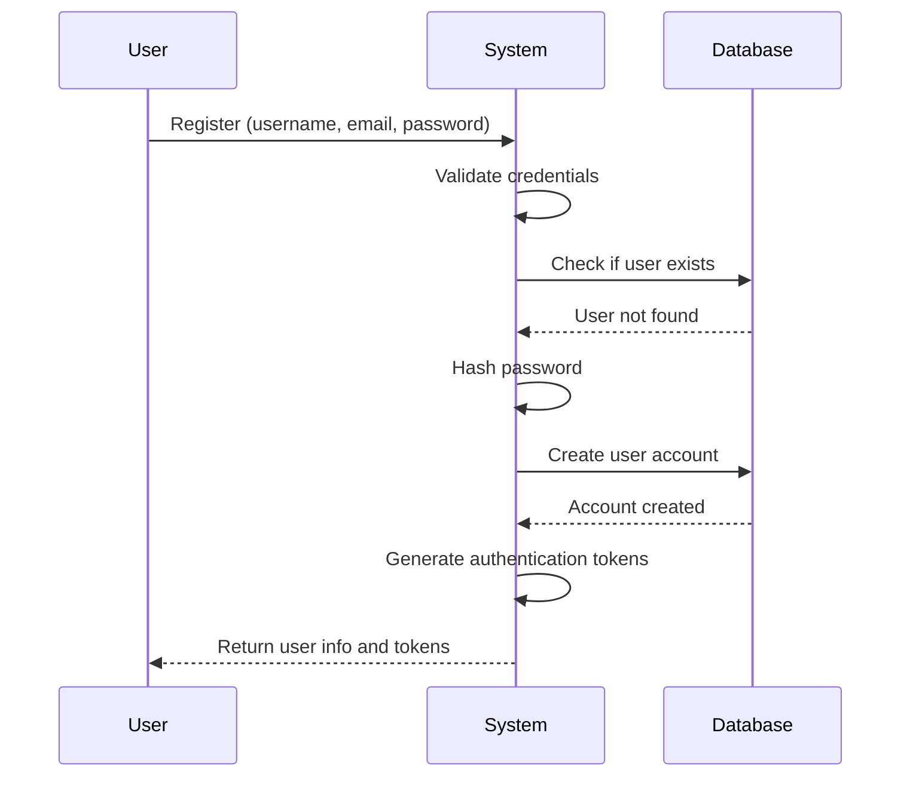
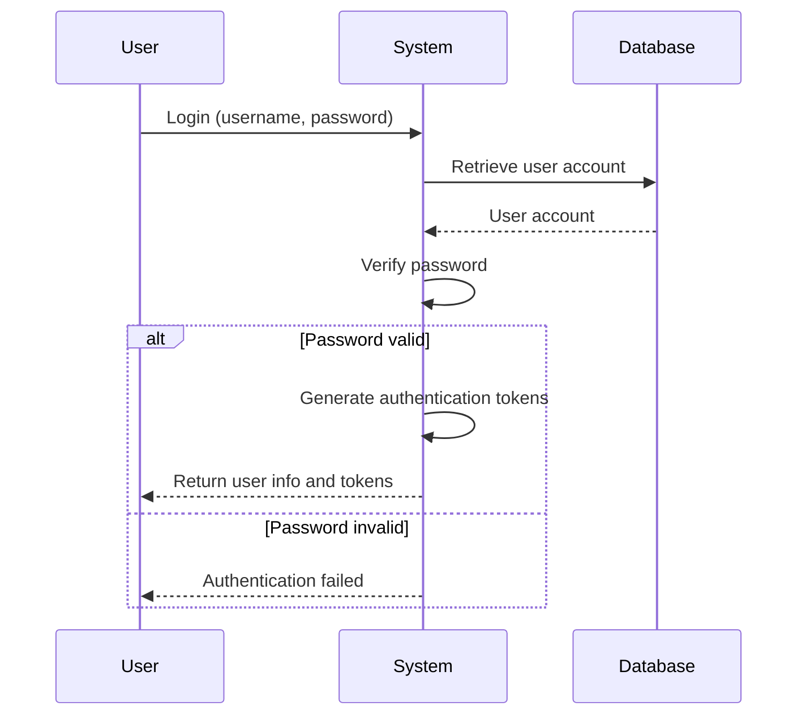
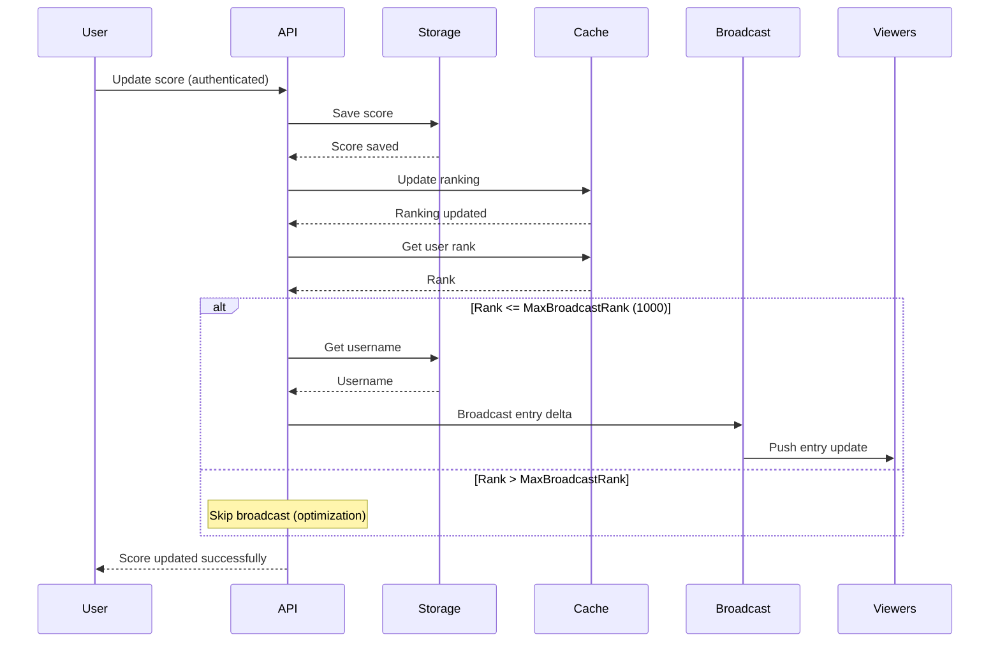
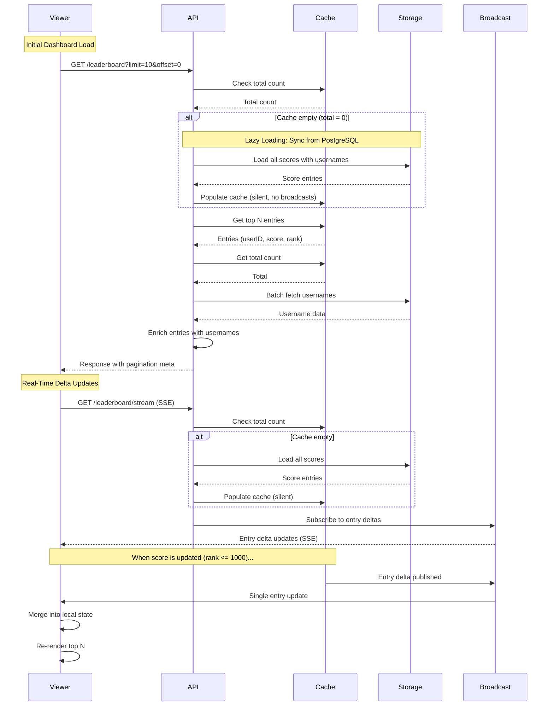

# Modules

The system is organized into self-contained modules, each following Clean Architecture principles.

For general application features and high-level flows, see [Application Features & Flows](./application.md).

## Auth Module

**Purpose**: User authentication and authorization

**Components**:
- **Domain**: `User` (`domain/user.go`), `TokenPair` (`domain/token.go`), domain errors (`domain/errors.go`)
- **Application**: `AuthUseCase` (`application/auth_usecase.go`), `UserRepository` interface (`application/repository.go`)
- **Adapters**: HTTP handlers (`adapters/rest/v1/handler.go`), error mapper (`adapters/rest/v1/error_mapper.go`)
- **Infrastructure**: PostgreSQL repository (`infrastructure/repository/postgres.go`), JWT manager (`infrastructure/jwt/jwt.go`)

For architectural details, see [Architecture](./architecture.md).

**Endpoints**:
- `POST /api/v1/auth/register` - User registration (public)
- `POST /api/v1/auth/login` - User login (public)
- `POST /api/v1/auth/refresh` - Refresh access token (public)
- `GET /api/v1/auth/me` - Get current user information (protected, requires authentication)

### User Registration Flow

**What Happens**:
1. User provides registration information
2. System validates and checks for existing accounts
3. Password is securely hashed
4. User account is created
5. Authentication tokens are generated
6. User receives account information and tokens

### User Login Flow

**What Happens**:
1. User provides login credentials
2. System retrieves user account
3. Password is verified
4. If valid, authentication tokens are generated and returned
5. If invalid, authentication error is returned

### Token Management

The system implements JWT-based authentication with automatic token management:

**Token Types**:
- **Access Token**: Short-lived token for API authentication (validated on every request)
- **Refresh Token**: Long-lived token for obtaining new access tokens

**Token Management Features**:
- **Proactive Refresh**: Tokens are automatically refreshed before expiration (configurable buffer time, default: 5 minutes)
- **Expiration Checking**: Token expiration is checked before making API requests
- **Automatic Retry**: Failed requests due to expired tokens are automatically retried after refresh
- **Secure Storage**: Tokens are stored securely in browser localStorage (SPA)
- **User Info Management**: User information is stored separately from tokens (no client-side JWT decoding)

**Current User Endpoint**:
- `GET /api/v1/auth/me` - Returns current authenticated user's information
- Requires valid JWT token in Authorization header
- Provides single source of truth for user information
- Used by SPA to fetch user info without decoding JWT tokens

**SPA Authentication Best Practices**:
- No client-side JWT decoding for user data extraction
- User information retrieved from API endpoints only
- Automatic token refresh prevents failed requests
- Proper error handling for authentication failures
- Token validation on all protected endpoints

## Leaderboard Module

**Purpose**: Score update and real-time leaderboard queries via Server-Sent Events (SSE)

**Components**:
- **Domain**: `LeaderboardEntry` (`domain/leaderboard.go`), constants (`domain/constants.go`)
- **Application**: 
  - `LeaderboardUseCase` - `SyncFromPostgres()`, `GetLeaderboard(limit, offset int64)`, `GetFullLeaderboard()` (internal), `SubscribeToEntryUpdates()`
  - `ScoreUseCase` - `SubmitScore()` (updates persistence/cache, broadcasts if rank <= 1000)
  - Repository interfaces: `LeaderboardPersistenceRepository`, `LeaderboardCacheRepository`, `UserRepository` (module-owned)
  - `BroadcastService` interface
- **Adapters**: HTTP handlers (`adapters/rest/v1/handler.go`), error mapper (`adapters/rest/v1/error_mapper.go`)
- **Infrastructure**: PostgreSQL/Redis repositories, Redis broadcast service

For architectural details, see [Architecture](./architecture.md).

**Endpoints**:
- `GET /api/v1/leaderboard?limit=10&offset=0` - Get paginated leaderboard (for initial dashboard load and Top N changes)
- `GET /api/v1/leaderboard/stream` - SSE stream for real-time entry delta updates (stays open, independent of pagination)
- `PUT /api/v1/leaderboard/score` - Update score (authenticated)

**Module Independence**: Owns its `UserRepository` interface (no dependency on auth module). For details on module independence, see [Architecture - Module Independence](./architecture.md#module-independence).

### Score Update Flow

**What Happens**:
1. Authenticated user submits new score
2. Score saved to PostgreSQL, ranking updated in Redis
3. If rank <= 1000: fetch username, create entry delta, broadcast via pub/sub
4. All connected viewers receive entry update via SSE and merge into local state
5. User receives confirmation

**Optimization**: Only entries ranked within top 1000 are broadcasted to reduce network traffic.

### Leaderboard Viewing Flow

**What Happens**:

1. **Initial Dashboard Load**:
   - Client calls `GET /leaderboard?limit=10&offset=0`
   - If cache empty: lazy load from PostgreSQL to Redis (silent, no broadcasts)
   - Retrieve top N from cache, batch fetch usernames, enrich entries
   - Return entries with pagination metadata

2. **Real-Time Delta Updates**:
   - Client connects to `GET /leaderboard/stream` (SSE) - **stays open**
   - Subscribe to entry delta updates via broadcast service
   - When score updated (rank <= 1000): single entry delta broadcasted, all viewers receive via SSE
   - Clients merge updates into local state and re-render

3. **Changing Top N**:
   - Client calls `GET /leaderboard?limit=50&offset=0` with new pagination
   - **Stream stays open** - only `/leaderboard` API called
   - Stream continues providing delta updates independently

**Key Characteristics**:
- Lazy loading: Auto-syncs from PostgreSQL when cache empty
- Real-time: Immediate updates via SSE (rank <= 1000)
- Efficient: Single broadcast updates all viewers via Redis pub/sub
- Scalable: Works across multiple server instances
- Independent: `/leaderboard` (pagination) and `/leaderboard/stream` (delta updates) operate separately

### Infrastructure Implementation Details

#### Redis Storage Strategy

**Sorted Sets for Leaderboard Storage**:
- Key: `leaderboard:global` (single global leaderboard)
- Score: User's total score (as Redis score)
- Member: User ID
- Commands: `ZADD` (update/add), `ZREVRANGE` (get top N), `ZCARD` (total players)
- Performance: O(log(N)) complexity for insertions, O(log(N)+M) for range queries
- All operations are atomic, no application-level locking needed

**Pub/Sub for Real-Time Notifications**:
- Topic: `leaderboard:viewer:updates` - Single entry delta updates (LeaderboardEntry JSON)
- MaxBroadcastRank: 1000 - Only top 1000 entries trigger broadcasts
