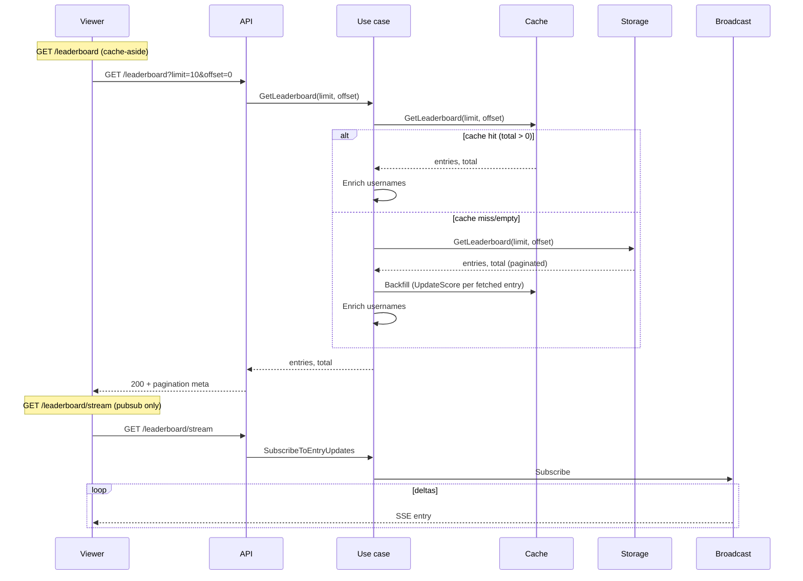

# Modules

The system is organized into self-contained modules, each following Clean Architecture principles.

For general application features and high-level flows, see [Application Features & Flows](./application.md).

## Auth Module

**Purpose**: User authentication and authorization

**Components**:
- **Domain**: `User` (`domain/user.go`), `TokenPair` (`domain/token.go`), domain errors (`domain/errors.go`)
- **Application**: `AuthUseCase` (`application/auth_usecase.go`), `UserRepository` interface (`application/repository.go`)
- **Adapters**: HTTP handlers (`adapters/rest/v1/handler.go`), error mapper (`adapters/rest/v1/error_mapper.go`)
- **Infrastructure**: PostgreSQL repository (`infrastructure/repository/postgres.go`), JWT manager (`infrastructure/jwt/jwt.go`)

For architectural details, see [Architecture](./architecture.md).

**Endpoints**:
- `POST /api/v1/auth/register` - User registration (public)
- `POST /api/v1/auth/login` - User login (public)
- `POST /api/v1/auth/refresh` - Refresh access token (public)
- `GET /api/v1/auth/me` - Get current user information (protected, requires authentication)

### User Registration Flow

**What Happens**:
1. User provides registration information
2. System validates and checks for existing accounts
3. Password is securely hashed
4. User account is created
5. Authentication tokens are generated
6. User receives account information and tokens

### User Login Flow

**What Happens**:
1. User provides login credentials
2. System retrieves user account
3. Password is verified
4. If valid, authentication tokens are generated and returned
5. If invalid, authentication error is returned

### Token Management

The system implements JWT-based authentication with automatic token management:

**Token Types**:
- **Access Token**: Short-lived token for API authentication (validated on every request)
- **Refresh Token**: Long-lived token for obtaining new access tokens

**Token Management Features**:
- **Proactive Refresh**: Tokens are automatically refreshed before expiration (configurable buffer time, default: 5 minutes)
- **Expiration Checking**: Token expiration is checked before making API requests
- **Automatic Retry**: Failed requests due to expired tokens are automatically retried after refresh
- **Secure Storage**: Tokens are stored securely in browser localStorage (SPA)
- **User Info Management**: User information is stored separately from tokens (no client-side JWT decoding)

**Current User Endpoint**:
- `GET /api/v1/auth/me` - Returns current authenticated user's information
- Requires valid JWT token in Authorization header
- Provides single source of truth for user information
- Used by SPA to fetch user info without decoding JWT tokens

**SPA Authentication Best Practices**:
- No client-side JWT decoding for user data extraction
- User information retrieved from API endpoints only
- Automatic token refresh prevents failed requests
- Proper error handling for authentication failures
- Token validation on all protected endpoints

## Leaderboard Module

**Purpose**: Score update and real-time leaderboard queries via Server-Sent Events (SSE)

**Data layer**: PostgreSQL = persistence; Redis = cache. All cache/persistence logic lives in use cases; handlers only invoke use cases.

**Components**:
- **Domain**: `LeaderboardEntry` (`domain/leaderboard.go`), constants (`domain/constants.go`)
- **Application**:
  - `LeaderboardUseCase` - `GetLeaderboard(limit, offset)`, `SubscribeToEntryUpdates()`
  - `ScoreUseCase` - `SubmitScore()` (write-through: cache then persistence; broadcasts if rank ≤ 1000)
  - Repository interfaces: `LeaderboardPersistenceRepository`, `LeaderboardCacheRepository`, `UserRepository` (module-owned), `BroadcastService`
- **Adapters**: HTTP handlers, error mapper
- **Infrastructure**: PostgreSQL (persistence) and Redis (cache) repositories, Redis broadcast service

**Repository Interface Methods**:
- `LeaderboardCacheRepository.GetLeaderboard(limit, offset)` - Returns paginated entries and total count in a single call
- `LeaderboardPersistenceRepository.GetLeaderboard(limit, offset)` - Returns paginated entries and total count (uses SQL LIMIT/OFFSET and COUNT(*) OVER())

**Endpoints**:
- `GET /api/v1/leaderboard?limit=10&offset=0` - Paginated leaderboard (cache-aside: cache first, PostgreSQL on global miss)
- `GET /api/v1/leaderboard/stream` - SSE stream for entry deltas only (pubsub, no cache/persistence reads)
- `PUT /api/v1/leaderboard/score` - Update score (write-through; requires auth)

**Module Independence**: Owns its `UserRepository` interface (no dependency on auth module). See [Architecture - Module Independence](./architecture.md#module-independence).

### Score Update Flow (write-through)

### Leaderboard Viewing Flow

**Behavior**:
- **GET /leaderboard**: Cache-aside strategy. Use case: tries cache first with `GetLeaderboard(limit, offset)`; if cache returns data (total > 0), enriches and returns; if cache miss/empty, calls `GetLeaderboard(limit, offset)` from PostgreSQL (paginated), backfills cache with fetched entries only, enriches, and returns. Both cache and persistence repositories use pagination at the database level (no in-memory pagination). Handler only calls `GetLeaderboard(limit, offset)`.
- **GET /leaderboard/stream**: Pubsub only. Use case: `SubscribeToEntryUpdates` (no cache or persistence). Handler: set SSE headers, call `SubscribeToEntryUpdates`, loop on channel. Clients must load initial state via GET /leaderboard first.
- **PUT /leaderboard/score**: Write-through. Use case: `UpdateScore` (cache) then `UpsertScore` (persistence); both must succeed. Then get rank, optionally broadcast if rank ≤ 1000.

**UI Behavior**:
- When a user's score update causes them to fall outside the displayed top N (e.g., rank 6 when limit is 5), the UI automatically reloads the leaderboard with a higher limit (at least the user's rank) to push them out of the original top N display area. This ensures the displayed top N always shows the actual top N players.

**Characteristics**: Cache-aside for reads and write-through for writes; stream is pubsub-only; broadcast only for rank ≤ 1000; `/leaderboard` and `/leaderboard/stream` are independent.

### Infrastructure

**Redis (cache)**:
- Sorted set `leaderboard:global`: score, member=userID. `ZADD`, `ZREVRANGE`, `ZCARD`.
- `GetLeaderboard(limit, offset)`: Uses `ZRevRangeWithScores` for paginated entries and `ZCard` for total count in a single call.
- Pub/sub `leaderboard:viewer:updates`: entry-delta JSON. Only rank ≤ 1000 triggers publish.

**PostgreSQL (persistence)**: 
- `leaderboard` table; `UpsertScore`, `GetLeaderboard(limit, offset)`.
- `GetLeaderboard` uses SQL `LIMIT`/`OFFSET` for pagination and `COUNT(*) OVER()` window function to get total count in the same query. Only fetches the requested page, not all entries.
